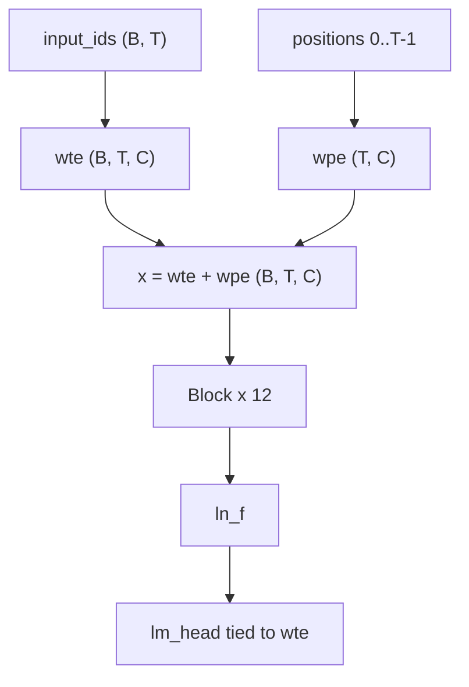

# basikGPT

[English](README.md) · **日本語** · [한국어](README.ko.md)

basikGPT は、**事前学習済み GPT-2 Small デコーダ専用 Transformer**（124,439,808 個の固有パラメータ）と、その学習に使用した PyTorch コードベースで構成されています。本モデルは事前学習済みの **ベース（base）モデル**です。

- 重み: [`project-iconik/basikGPT-1-v1.0`](https://huggingface.co/project-iconik/basikGPT-1-v1.0)（2.5B トークン）、[`project-iconik/basikGPT-1-v1.1`](https://huggingface.co/project-iconik/basikGPT-1-v1.1)（5B トークン）
- ホワイトペーパー: [`docs/whitepaper.ja.md`](docs/whitepaper.ja.md)（[EN](docs/whitepaper.md)、[KO](docs/whitepaper.ko.md)）
- 英語言語モデル評価スイート: [`benchmarks/REPORT.md`](benchmarks/REPORT.md)

本番学習 `main_2p5b` は、系列長 **1024** で 38,147 ステップ、**2,500,001,792** トークン（1 パラメータあたり約 20.09 トークン）を学習しました。継続学習 `cont_5b_mix` はそのチェックポイントから FineWeb 2.25B + OpenWebMath 0.25B で学習を続け、76,294 ステップで**累計 5,000,003,584 トークン**に達しました。

## クイックスタート

Python 3.12+ と PyTorch 2.1+。CUDA を利用する場合は、事前に [pytorch.org](https://pytorch.org/get-started/locally/) から環境に合った PyTorch をインストールしてください。

```bash
git clone https://github.com/project-iconik/basikGPT.git
cd basikGPT
pip install -e ".[dev]"
```

アーキテクチャとトークナイザは GPT-2 互換です。ARC-Easy で相対的に高い性能が必要な場合は FineWeb-Edu チェックポイントの **v1.0** を、LAMBADA は向上した一方で ARC-Easy は低下した累計 5B トークンの継続学習モデルが必要な場合は **v1.1** を使用してください。以下の例では v1.1 を読み込みます。Hub に公開されているモデルは `transformers.AutoModelForCausalLM.from_pretrained` で直接読み込めます。

```python
from transformers import AutoModelForCausalLM, AutoTokenizer

tok = AutoTokenizer.from_pretrained("project-iconik/basikGPT-1-v1.1")
model = AutoModelForCausalLM.from_pretrained("project-iconik/basikGPT-1-v1.1")
```

ネイティブの `.pt` チェックポイントは `basikgpt` パッケージを用いて読み込みます。`scripts/generate.py` は Hub ID ではなく、ローカルチェックポイントのパスを受け取ります。公式 `openai-community/gpt2` を参照モデルとして使用する場合は `--hf-reference` を指定します。

```bash
python scripts/generate.py --checkpoint runs/main_2p5b/step-00038147.pt --prompt "The history of artificial intelligence"
```

| 追加機能 | インストール | 用途 |
| --- | --- | --- |
| `data` | `pip install -e ".[data]"` | tiktoken、FineWeb 取り込み（`datasets`、`pyarrow`） |
| `dev` | `pip install -e ".[dev]"` | テスト、Hub エクスポート/ロード、および `data` |

コアモデルおよび学習コードの依存関係は `torch` と `numpy` のみです。

## 結果

ゼロショット英語言語モデル評価スイート（`english-lm-suite-v1`）では、すべての行に同じデータ分割、プロンプト、採点基準を適用しました。トークン数とアーキテクチャは **揃えていません**。結果の全一覧は [`benchmarks/REPORT.md`](benchmarks/REPORT.md) を参照してください。

| Model | size | HS | LAMBADA | PIQA | WG | ARC-E | Avg |
| --- | ---: | ---: | ---: | ---: | ---: | ---: | ---: |
| **v1.0** | 124M | 29.40 | 19.58 | 61.37 | 50.51 | **43.01** | 40.77 |
| **v1.1** | 124M | 28.75 | 23.05 | 61.75 | 50.83 | 38.51 | 40.58 |
| openai-community/gpt2 | 124M | 30.37 | 30.93 | 62.57 | 51.62 | 38.13 | 42.72 |
| HuggingFaceTB/SmolLM2-135M | 135M | 42.67 | 42.97 | 67.57 | 51.93 | 59.43 | 52.91 |
| EleutherAI/pythia-160m | 162M | 29.26 | 11.57 | 58.32 | 49.49 | 34.22 | 36.57 |
| chance | | 25 | — | 50 | 50 | ~25 | — |

WG には `acc_raw` を使用し、その他の列には評価スイートの主要指標を使用しています。Avg はこれら 5 指標の単純平均です。一部の同規模の従来型デコーダは本プロトコルでおおむね近い範囲にありますが、現代的なデータで学習された SmolLM2-135M は大幅に高いスコアを示します。WinoGrande はランダム予測と同水準です。評価手法と完全な比較は [ホワイトペーパー](docs/whitepaper.ja.md) を参照してください。

v1.0 の言語モデル指標（学習ループ内の検証は 131,072 トークンを対象とし、全検証は学習完了後に測定）:

| | |
| --- | --- |
| Tokens | 2,500,001,792 |
| 最終学習 CE | 3.2830 |
| 全検証 CE / PPL | 3.2548 / 25.9151 |
| 実経過時間 | 29,462.59 秒（約 8.18 GPU 時間） |
| Training-only tok/s | 85,076 |

```bash
pip install -e ".[dev]"
python scripts/evaluate_lm_suite.py --checkpoint runs/main_2p5b/step-00038147.pt
python scripts/evaluate_lm_suite.py --hf-model openai-community/gpt2
```

## アーキテクチャ

GPT-2 因果デコーダは、事前正規化（Pre-Norm）、LayerNorm（ε = 1e-5）、学習可能な絶対位置埋め込み、因果的マルチヘッド自己注意、GELU の tanh 近似、Linear と LayerNorm のバイアス、共有埋め込みを使用します。ブロック内部は [ホワイトペーパー §4](docs/whitepaper.ja.md#4-モデル) を参照してください。



| | `gpt2_small` |
| --- | --- |
| 固有パラメータ | 124,439,808 |
| `vocab_size` | 50,257 |
| `d_model` | 768 |
| `n_layers` | 12 |
| `n_heads` | 12 |
| `head_dim` | 64 |
| `d_ff` | 3,072 |
| `context_length` | 1,024 |
| 学習系列長 | **1024** |
| `tie_word_embeddings` | true |
| 学習時のドロップアウト | **0.0**（`GPTConfig` の既定値は 0.1） |

`GPTConfig` は `gpt2_medium`、`gpt2_large`、`gpt2_xl` も定義します。これらは設定プリセットのみであり、本リポジトリで実際に学習したモデルは `gpt2_small` です。

## トークナイザ

GPT-2 のバイトレベル BPE（`tiktoken.get_encoding("gpt2")`）を使用します。語彙サイズは 50,257、文書終了トークン ID は 50,256 です。学習データの取り込みでは `encode_ordinary()` を適用し、各文書の末尾に EOT トークンを 1 つ付与します。Hub エクスポートには公式 GPT-2 トークナイザファイルが同梱されます。詳細は [ホワイトペーパー §5](docs/whitepaper.ja.md#5-トークナイザ) を参照してください。

## データ

v1.0 は FineWeb-Edu（`sample-10BT`）で学習しました。v1.1 は FineWeb 2.25B + OpenWebMath 0.25B で継続学習しました（累積構成: Edu 50% + FineWeb 45% + OpenWebMath 5%）。Hub ストリームは uint16 `.npy` シャードにパックします。生データおよびシャードファイルはローカル `data/` 配下に保存され、`.gitignore` により Git の追跡対象外となります。


データ構成の全表とライセンスは [ホワイトペーパー §6](docs/whitepaper.ja.md#6-データ) を参照してください。

## 再現

### A. 公開重みを使う（既定）

[クイックスタート](#クイックスタート) を参照してください。

### B. FineWeb-Edu 2.5B を再学習する

数十 GB のディスク容量と Hugging Face Hub のストリーミング接続が必要です。`scripts/train.py` は設定 JSON を直接読み込まず、本番実行時はこれと同等の CLI 引数を指定して学習を行いました。

```bash
python scripts/prepare_fineweb_edu.py \
  --output data/fineweb-edu-2p5b \
  --max-train-tokens 2500000000 \
  --shard-token-target 1000000
python scripts/train.py \
  --model-preset gpt2_small --device cuda --precision bf16 \
  --batch-size 8 --grad-accum-steps 8 \
  --target-tokens 2500000000 \
  --warmup-steps 2000 --lr 6e-4 --min-lr 6e-5 \
  --eval-at-start --eval-tokens 131072 --eval-interval 1526 \
  --log-interval 10 \
  --checkpoint-steps 1526,7630,15259,38147 \
  --no-shuffle --track-data-index \
  --data-dir data/fineweb-edu-2p5b \
  --output-dir runs/main_2p5b
```

設定 [`configs/gpt2_small_fineweb_edu_single_gpu.json`](configs/gpt2_small_fineweb_edu_single_gpu.json) は、暫定学習レシピのスナップショットを記録しています。本番実行時の最大 CUDA 割り当てメモリ量は **9,523.61 MiB** でした。

各 `train.py` 実行結果は `runs/<name>/` 配下に保存されます。公開された手法と指標は [ホワイトペーパー](docs/whitepaper.ja.md) で確認できます。ステップログ（`metrics.jsonl`）とシャードマニフェスト（`dataset.json`）は、`.gitignore` により Git の追跡対象外となります。

### C. Tiny CPU スモークテスト（実験および検証用）

先にスモーク用シャードディレクトリが必要です。

```bash
python scripts/prepare_fineweb_edu.py --output data/fineweb-edu-smoke
python scripts/train.py --model-preset tiny --max-steps 20 --device cpu --data-dir data/fineweb-edu-smoke
```

## リポジトリ構成

- `src/basikgpt/model` — GPT-2 バックボーンと因果 LM
- `src/basikgpt/data` — トークナイザ、シャーディング、FineWeb パイプライン
- `src/basikgpt/training` — オプティマイザ、スケジューラ、トレーナ、チェックポイント
- `src/basikgpt/generation` — KV キャッシュを用いたテキスト生成
- `src/basikgpt/evaluation` — val CE/PPL と English LM suite
- `src/basikgpt/conversion` — Hugging Face GPT-2 形式のインポート/エクスポート
- `scripts` — train、generate、evaluate、prepare、export
- `configs` — 凍結済み単一 GPU 設定 JSON
- `docs` — 技術ホワイトペーパー（EN / JA / KO）とレシピメモ
- `benchmarks` — English LM suite プロトコルと評価スコア
- `runs` — 公開 `run.json` / `summary.json`（チェックポイントはローカル）

## テスト

```bash
pip install -e ".[dev]"
pytest tests/ -q
```

## コントリビューション

Issue と Pull Request を歓迎します。変更を提出する前に `pytest tests/ -q` を実行してください。

## 引用

```
@software{basikgpt,
  title = {basikGPT},
  author = {basikGPT Contributors},
  url = {https://github.com/project-iconik/basikGPT},
  year = {2026}
}
```

## ライセンス

コードおよびエクスポートされた重みには **Apache-2.0** ライセンスが適用されます。FineWeb と FineWeb-Edu には引き続き **ODC-By 1.0** が適用されます。OpenWebMath の条件は Hub データセットカードを参照してください。再配布前に各データセットカードを確認してください。詳細は [ホワイトペーパー §11](docs/whitepaper.ja.md#11-想定用途限界ライセンス) を参照してください。
