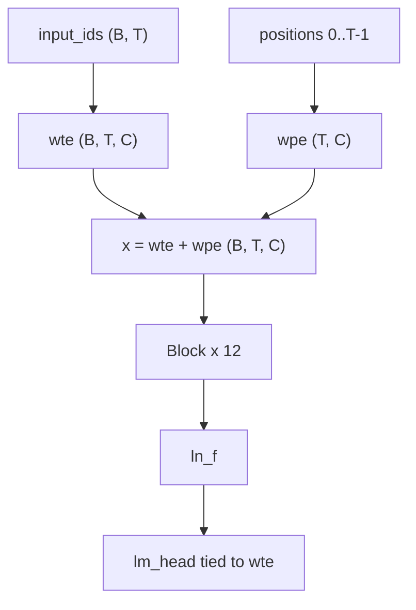
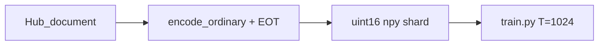

# basikGPT

[English](README.md) · [日本語](README.ja.md) · **한국어**

basikGPT는 고유 파라미터 124,439,808개의 **사전학습된 GPT-2 Small 디코더 전용 Transformer**와 이를 학습하는 데 사용한 PyTorch 코드베이스로 구성됩니다. 본 모델은 사전학습된 **베이스(base)** 모델입니다.

- 가중치: [`project-iconik/basikGPT-1-v1.0`](https://huggingface.co/project-iconik/basikGPT-1-v1.0) (2.5B 토큰), [`project-iconik/basikGPT-1-v1.1`](https://huggingface.co/project-iconik/basikGPT-1-v1.1) (5B 토큰)
- 백서: [`docs/whitepaper.ko.md`](docs/whitepaper.ko.md) ([EN](docs/whitepaper.md), [JA](docs/whitepaper.ja.md))
- 영어 언어 모델 평가 스위트: [`benchmarks/REPORT.md`](benchmarks/REPORT.md)

프로덕션 실행 `main_2p5b`는 시퀀스 길이 **1024**로 38,147스텝에 걸쳐 **2,500,001,792**토큰(파라미터당 약 20.09토큰)을 학습했습니다. 연속 학습 실행 `cont_5b_mix`는 해당 체크포인트에서 시작해 FineWeb 2.25B + OpenWebMath 0.25B를 추가로 학습했으며, 76,294스텝에서 **누적 5,000,003,584토큰**에 도달했습니다.

## 빠른 시작

Python 3.12+ 및 PyTorch 2.1+. CUDA 환경의 경우, 먼저 [pytorch.org](https://pytorch.org/get-started/locally/)에서 환경에 맞는 PyTorch를 설치하세요.

```bash
git clone https://github.com/project-iconik/basikGPT.git
cd basikGPT
pip install -e ".[dev]"
```

아키텍처와 토크나이저는 GPT-2와 호환됩니다. 상대적으로 높은 ARC-Easy 점수가 필요한 경우에는 FineWeb-Edu 체크포인트인 **v1.0**을, LAMBADA 점수가 높고 ARC-Easy 점수가 낮은 5B 연속 학습 모델이 필요한 경우에는 **v1.1**을 사용하세요. 아래 예시는 v1.1을 로드합니다. Hugging Face Hub에 배포된 가중치는 `transformers.AutoModelForCausalLM.from_pretrained`로 직접 로드할 수 있습니다.

```python
from transformers import AutoModelForCausalLM, AutoTokenizer

tok = AutoTokenizer.from_pretrained("project-iconik/basikGPT-1-v1.1")
model = AutoModelForCausalLM.from_pretrained("project-iconik/basikGPT-1-v1.1")
```

네이티브 `.pt` 체크포인트는 `basikgpt` 패키지로 로드합니다. `scripts/generate.py`는 Hub ID가 아닌 로컬 체크포인트 경로를 인자로 받습니다. 공식 `openai-community/gpt2`를 참조 모델로 사용하려면 `--hf-reference`를 지정하세요.

```bash
python scripts/generate.py --checkpoint runs/main_2p5b/step-00038147.pt --prompt "The history of artificial intelligence"
```

| 추가 기능 | 설치 | 용도 |
| --- | --- | --- |
| `data` | `pip install -e ".[data]"` | tiktoken, FineWeb 데이터 인제스트(수집/전처리) (`datasets`, `pyarrow`) |
| `dev` | `pip install -e ".[dev]"` | 테스트, Hub 내보내기/로드 및 `data` 의존성 포함 |

코어 모델과 학습 코드의 의존성은 `torch`와 `numpy`뿐입니다.

## 결과

제로샷 영어 언어 모델 평가 스위트(`english-lm-suite-v1`)에서는 모든 행에 동일한 데이터 분할, 프롬프트, 채점 방식을 적용했습니다. 토큰 수와 아키텍처는 **일치시키지 않았습니다**. 전체 결과는 [`benchmarks/REPORT.md`](benchmarks/REPORT.md)에서 확인할 수 있습니다.

| Model | size | HS | LAMBADA | PIQA | WG | ARC-E | Avg |
| --- | ---: | ---: | ---: | ---: | ---: | ---: | ---: |
| **v1.0** | 124M | 29.40 | 19.58 | 61.37 | 50.51 | **43.01** | 40.77 |
| **v1.1** | 124M | 28.75 | 23.05 | 61.75 | 50.83 | 38.51 | 40.58 |
| openai-community/gpt2 | 124M | 30.37 | 30.93 | 62.57 | 51.62 | 38.13 | 42.72 |
| HuggingFaceTB/SmolLM2-135M | 135M | 42.67 | 42.97 | 67.57 | 51.93 | 59.43 | 52.91 |
| EleutherAI/pythia-160m | 162M | 29.26 | 11.57 | 58.32 | 49.49 | 34.22 | 36.57 |
| chance | | 25 | — | 50 | 50 | ~25 | — |

WG에는 `acc_raw`를 사용하고, 나머지 열에는 평가 스위트의 주요 지표를 사용했습니다. Avg는 이들 다섯 지표의 단순 평균입니다. 일부 비슷한 크기의 기존 디코더 모델은 이 프로토콜에서 대체로 비슷한 범위에 있지만, 현대적인 데이터로 학습한 SmolLM2-135M은 훨씬 높은 점수를 기록합니다. WinoGrande 결과는 무작위 추측 수준입니다. 방법론과 전체 비교는 [백서](docs/whitepaper.ko.md)를 참조하세요.

v1.0 언어 모델 지표(학습 루프 내 검증은 131,072토큰을 대상으로 하며, 전체 검증은 학습 완료 후 측정):

| | |
| --- | --- |
| Tokens | 2,500,001,792 |
| 마지막 학습 CE | 3.2830 |
| 전체 검증 CE / PPL | 3.2548 / 25.9151 |
| 실제 경과 시간 | 29,462.59초(약 8.18 GPU 시간) |
| Training-only tok/s | 85,076 |

```bash
pip install -e ".[dev]"
python scripts/evaluate_lm_suite.py --checkpoint runs/main_2p5b/step-00038147.pt
python scripts/evaluate_lm_suite.py --hf-model openai-community/gpt2
```

## 아키텍처

GPT-2 인과 디코더는 사전 정규화(Pre-Norm), LayerNorm(ε = 1e-5), 학습 가능한 절대 위치 임베딩, 인과적 다중 헤드 자기 어텐션, GELU tanh 근사, Linear·LayerNorm 편향, 공유 임베딩을 사용합니다. 블록 내부 구조는 [백서 §4](docs/whitepaper.ko.md#4-모델)를 참조하세요.



| | `gpt2_small` |
| --- | --- |
| 고유 파라미터 | 124,439,808 |
| `vocab_size` | 50,257 |
| `d_model` | 768 |
| `n_layers` | 12 |
| `n_heads` | 12 |
| `head_dim` | 64 |
| `d_ff` | 3,072 |
| `context_length` | 1,024 |
| 학습 시퀀스 길이 | **1024** |
| `tie_word_embeddings` | true |
| 학습 드롭아웃 | **0.0** (`GPTConfig` 기본값은 0.1) |

`GPTConfig`는 `gpt2_medium`, `gpt2_large`, `gpt2_xl`도 정의합니다. 해당 프리셋들은 설정 정의용이며, 본 저장소에서 실제로 학습한 모델은 `gpt2_small`입니다.

## 토크나이저

GPT-2 바이트 수준 BPE(`tiktoken.get_encoding("gpt2")`)를 사용합니다. 어휘 크기는 50,257이며, 문서 종료 토큰 ID는 50,256입니다. 학습 데이터 전처리에는 `encode_ordinary()`를 사용하며 각 문서 끝에 EOT 토큰을 하나 추가합니다. Hub 내보내기에는 공식 GPT-2 토크나이저 파일이 포함됩니다. 자세한 내용은 [백서 §5](docs/whitepaper.ko.md#5-토크나이저)를 참조하세요.

## 데이터

v1.0은 FineWeb-Edu(`sample-10BT`)로 학습했습니다. v1.1은 FineWeb 2.25B + OpenWebMath 0.25B 데이터로 후속 학습했습니다(누적 믹스: Edu 50% + FineWeb 45% + OpenWebMath 5%). Hub 스트림 데이터는 uint16 `.npy` 샤드로 패킹하여 저장합니다. 원본 데이터와 샤드 파일은 로컬 `data/`에 저장되며 Git 관리 대상이 아닙니다.



전체 데이터 구성표와 라이선스는 [백서 §6](docs/whitepaper.ko.md#6-데이터)를 참조하세요.

## 재현

### A. 공개 가중치 사용 (기본)

[빠른 시작](#빠른-시작)을 참조하세요.

### B. FineWeb-Edu 2.5B 다시 학습

수십 GB의 디스크 공간과 Hugging Face Hub 스트리밍 연결이 필요합니다. `scripts/train.py`는 설정 JSON 파일을 직접 읽지 않으며, 프로덕션 실행 시에는 이와 동등한 CLI 플래그를 사용했습니다.

```bash
python scripts/prepare_fineweb_edu.py \
  --output data/fineweb-edu-2p5b \
  --max-train-tokens 2500000000 \
  --shard-token-target 1000000
python scripts/train.py \
  --model-preset gpt2_small --device cuda --precision bf16 \
  --batch-size 8 --grad-accum-steps 8 \
  --target-tokens 2500000000 \
  --warmup-steps 2000 --lr 6e-4 --min-lr 6e-5 \
  --eval-at-start --eval-tokens 131072 --eval-interval 1526 \
  --log-interval 10 \
  --checkpoint-steps 1526,7630,15259,38147 \
  --no-shuffle --track-data-index \
  --data-dir data/fineweb-edu-2p5b \
  --output-dir runs/main_2p5b
```

설정 [`configs/gpt2_small_fineweb_edu_single_gpu.json`](configs/gpt2_small_fineweb_edu_single_gpu.json)은 잠정 학습 레시피의 스냅샷을 기록합니다. 프로덕션 실행에서 측정한 최대 CUDA 메모리 할당량은 **9,523.61 MiB**였습니다.

각 `train.py` 실행 결과는 `runs/<name>/` 하위에 기록됩니다. 공개된 방법과 지표는 [백서](docs/whitepaper.ko.md)에서 확인할 수 있습니다. 스텝 로그(`metrics.jsonl`)와 샤드 매니페스트(`dataset.json`)는 `.gitignore` 설정에 따라 Git 추적에서 제외됩니다.

### C. Tiny CPU 스모크 테스트 (실험 및 검증용)

먼저 스모크용 샤드 디렉터리가 필요합니다.

```bash
python scripts/prepare_fineweb_edu.py --output data/fineweb-edu-smoke
python scripts/train.py --model-preset tiny --max-steps 20 --device cpu --data-dir data/fineweb-edu-smoke
```

## 저장소 구조

- `src/basikgpt/model` — GPT-2 백본과 인과 LM
- `src/basikgpt/data` — 토크나이저, 샤딩, FineWeb 파이프라인
- `src/basikgpt/training` — 옵티마이저, 스케줄러, 트레이너, 체크포인트
- `src/basikgpt/generation` — KV 캐시 기반 텍스트 생성
- `src/basikgpt/evaluation` — val CE/PPL과 English LM suite
- `src/basikgpt/conversion` — Hugging Face GPT-2 가져오기/내보내기
- `scripts` — train, generate, evaluate, prepare, export
- `configs` — 동결된 단일 GPU 설정 JSON
- `docs` — 기술 백서(EN / JA / KO)와 레시피 메모
- `benchmarks` — English LM suite 프로토콜과 점수
- `runs` — 공개 `run.json` / `summary.json` (체크포인트는 로컬)

## 테스트

```bash
pip install -e ".[dev]"
pytest tests/ -q
```

## 기여

이슈와 풀 리퀘스트를 환영합니다. 변경 사항을 제출하기 전에 `pytest tests/ -q`를 실행해 테스트를 통과하는지 확인하세요.

## 인용

```
@software{basikgpt,
  title = {basikGPT},
  author = {basikGPT Contributors},
  url = {https://github.com/project-iconik/basikGPT},
  year = {2026}
}
```

## 라이선스

코드와 배포된 가중치에는 **Apache-2.0** 라이선스가 적용됩니다. FineWeb과 FineWeb-Edu에는 **ODC-By 1.0**이 계속 적용됩니다. OpenWebMath의 조건은 Hub 데이터셋 카드를 참조하세요. 재배포 전에 각 데이터셋 카드를 확인해야 합니다. 자세한 내용은 [백서 §11](docs/whitepaper.ko.md#11-용도-한계-라이선스)을 참조하세요.
