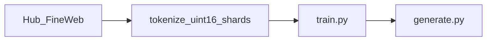

# basikGPT

[English](README.md) · [日本語](README.ja.md) · **한국어**

basikGPT는 **사전학습된 GPT-2 Small decoder-only Transformer**(124,439,808 고유 파라미터)와 그것을 학습한 PyTorch 코드다. **base** 체크포인트이며 instruction-tuned 챗봇이 아니다.

- 가중치: [`project-iconik/basikGPT-1-v1.0`](https://huggingface.co/project-iconik/basikGPT-1-v1.0) (2.5B 토큰), [`project-iconik/basikGPT-1-v1.1`](https://huggingface.co/project-iconik/basikGPT-1-v1.1) (5B 토큰)
- 백서: [`docs/whitepaper.md`](docs/whitepaper.md) ([JA](docs/whitepaper.ja.md), [KO](docs/whitepaper.ko.md))
- English LM suite: [`benchmarks/REPORT.md`](benchmarks/REPORT.md)

프로덕션 런 `main_2p5b`: 38,147 steps, **2,500,001,792** 토큰(약 20.09 tokens/parameter), 시퀀스 길이 **1024**. 연속 `cont_5b_mix`는 그 체크포인트를 FineWeb 2.25B + OpenWebMath 0.25B로 생애 **5,000,003,584** 토큰(step 76,294)까지 이어간다.

## Quick start

Python 3.12+와 PyTorch 2.1+. CUDA는 먼저 [pytorch.org](https://pytorch.org/get-started/locally/)에서 PyTorch를 설치한다.

```bash
git clone https://github.com/project-iconik/basikGPT.git
cd basikGPT
pip install -e ".[dev]"
```

아키텍처와 토크나이저는 GPT-2와 같다. `transformers.AutoModelForCausalLM.from_pretrained`는 Hub 내보내기를 **로드한다**:

```python
from transformers import AutoModelForCausalLM, AutoTokenizer

tok = AutoTokenizer.from_pretrained("project-iconik/basikGPT-1-v1.1")
model = AutoModelForCausalLM.from_pretrained("project-iconik/basikGPT-1-v1.1")
```

네이티브 `.pt`는 `basikgpt` 패키지로 로드한다. `scripts/generate.py`는 로컬 체크포인트(또는 공식 `openai-community/gpt2`용 `--hf-reference`)를 받으며 Hub id는 받지 않는다.

```bash
python scripts/generate.py --checkpoint runs/main_2p5b/step-00038147.pt --prompt "The history of artificial intelligence"
```

| Extra | Install | Use |
| --- | --- | --- |
| `data` | `pip install -e ".[data]"` | tiktoken, FineWeb 수집 (`datasets`, `pyarrow`) |
| `dev` | `pip install -e ".[dev]"` | 테스트, Hub 내보내기/로드, 그리고 `data` |

코어 모델과 학습 코드의 의존성은 `torch`와 `numpy`뿐이다.

## Results

제로샷 English LM suite(`english-lm-suite-v1`): 모든 행에 같은 split·프롬프트·채점. 토큰 수와 아키텍처는 **맞추지 않았다**. 전체 표: [`benchmarks/REPORT.md`](benchmarks/REPORT.md).

| Model | size | HS | LAMBADA | PIQA | WG | ARC-E |
| --- | ---: | ---: | ---: | ---: | ---: | ---: |
| **basikGPT-1 v1.0** | 124M | 29.40 | 19.58 | 61.37 | 50.51 | **43.01** |
| **basikGPT-1 v1.1** | 124M | 28.75 | 23.05 | 61.75 | 50.83 | 38.51 |
| openai-community/gpt2 | 124M | 30.37 | 30.93 | 62.57 | 51.62 | 38.13 |
| HuggingFaceTB/SmolLM2-135M | 135M | 42.67 | 42.97 | 67.57 | 51.93 | 59.43 |
| EleutherAI/pythia-160m | 162M | 29.26 | 11.57 | 58.32 | 49.49 | 34.22 |
| chance | | 25 | — | 50 | 50 | ~25 |

WG는 acc_raw, 나머지 열은 스위트 primary metric. 이 프로토콜의 같은 크기 공개 디코더는 가깝고, 현대 135M 믹스는 더 높다. WinoGrande는 우연 수준. 방법과 전체 비교: [백서](docs/whitepaper.ko.md).

v1.0 언어모델 지표(루프 안 val은 131,072 토큰, full val은 사후):

| | |
| --- | --- |
| Tokens | 2,500,001,792 |
| Last train CE | 3.2830 |
| Full val CE / PPL | 3.2548 / 25.9151 |
| Wall time | 29,462.59 s (약 8.18 GPU hours) |
| Training-only tok/s | 85,076 |

```bash
pip install -e ".[dev]"
python scripts/evaluate_lm_suite.py --checkpoint runs/main_2p5b/step-00038147.pt
python scripts/evaluate_lm_suite.py --hf-model openai-community/gpt2
```

## Architecture

GPT-2 인과 디코더: Pre-Norm, LayerNorm(ε = 1e-5), 학습된 절대 위치, 인과적 multi-head self-attention, GELU tanh 근사, Linear와 LayerNorm bias, tied embeddings. 상세: [백서 §4](docs/whitepaper.ko.md#4-모델).

| | `gpt2_small` |
| --- | --- |
| Unique parameters | 124,439,808 |
| `vocab_size` | 50,257 |
| `d_model` | 768 |
| `n_layers` | 12 |
| `n_heads` | 12 |
| `head_dim` | 64 |
| `d_ff` | 3,072 |
| `context_length` | 1,024 |
| Training sequence length | **1024** |
| `tie_word_embeddings` | true |
| Training dropout | **0.0** (`GPTConfig` 기본값은 0.1) |

`GPTConfig`는 `gpt2_medium`, `gpt2_large`, `gpt2_xl`도 정의한다. 그것들은 설정만일 뿐이다. 이 저장소가 학습한 것은 `gpt2_small`.

## Tokenizer

GPT-2 byte-level BPE(`tiktoken.get_encoding("gpt2")`). 어휘 50,257. End-of-text id 50,256. 커스텀 토크나이저는 없다. 학습 수집은 `encode_ordinary()` 후 문서마다 EOT를 하나 붙인다. Hub 내보내기는 공식 GPT-2 토크나이저 파일을 포함한다. 상세: [백서 §5](docs/whitepaper.ko.md#5-토크나이저).

## Data

v1.0은 FineWeb-Edu(`sample-10BT`). v1.1은 FineWeb 2.25B + OpenWebMath 0.25B로 이어간다(생애 믹스: Edu 50% + FineWeb 45% + OpenWebMath 5%). Hub 스트림은 uint16 `.npy` 샤드로 팩한다. 원본과 샤드는 로컬 `data/`에 있으며 git에 없다.



믹스 표와 라이선스: [백서 §6](docs/whitepaper.ko.md#6-데이터).

## Reproduce

### A. 공개 가중치 사용 (기본)

[Quick start](#quick-start)를 본다. 팩된 코퍼스는 필요 없다. 추론에 24 GB GPU는 필요 없다.

### B. FineWeb-Edu 2.5B 다시 학습

디스크 수십 GB와 Hugging Face Hub 스트림이 필요하다. `scripts/train.py`는 동결 JSON을 읽지 않는다. 프로덕션은 동등 CLI 플래그를 썼다.

```bash
python scripts/prepare_fineweb_edu.py \
  --output data/fineweb-edu-2p5b \
  --max-train-tokens 2500000000 \
  --shard-token-target 1000000
python scripts/train.py \
  --model-preset gpt2_small --device cuda --precision bf16 \
  --batch-size 8 --grad-accum-steps 8 \
  --target-tokens 2500000000 \
  --warmup-steps 2000 --lr 6e-4 --min-lr 6e-5 \
  --eval-at-start --eval-tokens 131072 --eval-interval 1526 \
  --log-interval 10 \
  --checkpoint-steps 1526,7630,15259,38147 \
  --no-shuffle --track-data-index \
  --data-dir data/fineweb-edu-2p5b \
  --output-dir runs/main_2p5b
```

설정 [`configs/gpt2_small_fineweb_edu_single_gpu.json`](configs/gpt2_small_fineweb_edu_single_gpu.json)은 동결 레시피를 기록한다(provisional, 최적 주장 아님). 프로덕션 피크 CUDA allocated는 **9,523.61 MiB**.

각 `train.py` 실행은 `runs/<name>/`에 쓴다. 공개된 방법과 지표는 [백서](docs/whitepaper.ko.md)에 있다. 스텝 로그(`metrics.jsonl`)와 샤드 매니페스트(`dataset.json`)는 gitignore된다.

### C. Tiny CPU 스모크 (실험만)

프로덕션 학습셋이 아니다. 먼저 스모크 샤드 디렉터리가 필요하다.

```bash
python scripts/prepare_fineweb_edu.py --output data/fineweb-edu-smoke
python scripts/train.py --model-preset tiny --max-steps 20 --device cpu --data-dir data/fineweb-edu-smoke
```

## Layout

- `src/basikgpt/model` — GPT-2 백본과 인과 LM
- `src/basikgpt/data` — 토크나이저, 샤딩, FineWeb 파이프라인
- `src/basikgpt/training` — optimizer, scheduler, trainer, 체크포인트
- `src/basikgpt/generation` — KV 캐시 생성
- `src/basikgpt/evaluation` — val CE/PPL과 English LM suite
- `src/basikgpt/conversion` — Hugging Face GPT-2 가져오기/내보내기
- `scripts` — train, generate, evaluate, prepare, export
- `configs` — 동결된 단일 GPU JSON
- `docs` — 기술 백서(EN / JA / KO)와 레시피 메모
- `benchmarks` — English LM suite 프로토콜과 점수
- `runs` — 공개 `run.json` / `summary.json` (체크포인트는 로컬)

## Tests

```bash
pip install -e ".[dev]"
pytest tests/ -q
```

## Contributing

이슈와 pull request를 환영한다. 변경을 보내기 전에 `pytest tests/ -q`를 실행하라.

## License

코드와 내보낸 가중치는 **Apache-2.0**. FineWeb / FineWeb-Edu는 **ODC-By 1.0**. OpenWebMath는 Hub 데이터셋 카드를 본다. 재배포 전에 각 카드를 확인하라. 상세: [백서 §11](docs/whitepaper.ko.md#11-용도-한계-라이선스).
