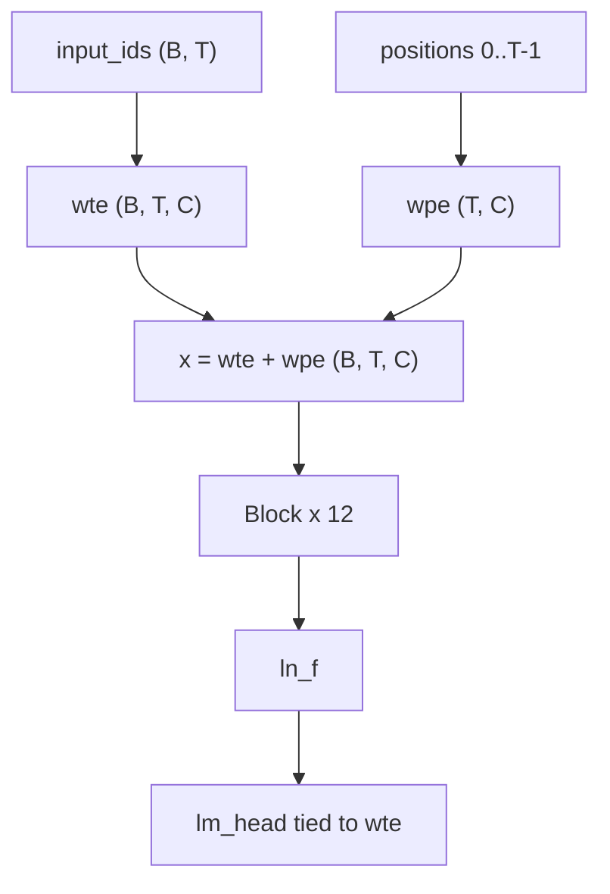

# basikGPT

**English** · [日本語](README.ja.md) · [한국어](README.ko.md)

basikGPT is a **pretrained GPT-2 Small decoder-only Transformer** (124,439,808 unique parameters), along with the PyTorch code used to train it. It is a **base** model.

- Weights: [`project-iconik/basikGPT-1-v1.0`](https://huggingface.co/project-iconik/basikGPT-1-v1.0) (2.5B tokens), [`project-iconik/basikGPT-1-v1.1`](https://huggingface.co/project-iconik/basikGPT-1-v1.1) (5B tokens)
- Whitepaper: [`docs/whitepaper.md`](docs/whitepaper.md) ([JA](docs/whitepaper.ja.md), [KO](docs/whitepaper.ko.md))
- English LM suite: [`benchmarks/REPORT.md`](benchmarks/REPORT.md)

Production run `main_2p5b`: 38,147 steps, **2,500,001,792** tokens (~20.09 tokens/parameter), trained at sequence length **1024**. The continuation run `cont_5b_mix` resumes from that checkpoint on FineWeb 2.25B + OpenWebMath 0.25B, bringing the lifetime total to **5,000,003,584** tokens (step 76,294).

## Quick start

Python 3.12+ and PyTorch 2.1+. For CUDA, install PyTorch from [pytorch.org](https://pytorch.org/get-started/locally/) first.

```bash
git clone https://github.com/project-iconik/basikGPT.git
cd basikGPT
pip install -e ".[dev]"
```

Architecture and tokenizer match GPT-2. Use **v1.0** for the FineWeb-Edu checkpoint (stronger performance on ARC-Easy). Use **v1.1** for the 5B continuation (higher LAMBADA accuracy, lower ARC-Easy). The snippet below loads v1.1. The Hub export can be loaded directly with `transformers.AutoModelForCausalLM.from_pretrained`:

```python
from transformers import AutoModelForCausalLM, AutoTokenizer

tok = AutoTokenizer.from_pretrained("project-iconik/basikGPT-1-v1.1")
model = AutoModelForCausalLM.from_pretrained("project-iconik/basikGPT-1-v1.1")
```

Native `.pt` checkpoints load through the `basikgpt` package. `scripts/generate.py` takes a local checkpoint (or `--hf-reference` for official `openai-community/gpt2`), not a Hub id.

```bash
python scripts/generate.py --checkpoint runs/main_2p5b/step-00038147.pt --prompt "The history of artificial intelligence"
```

| Extra | Install | Use |
| --- | --- | --- |
| `data` | `pip install -e ".[data]"` | tiktoken, FineWeb ingest (`datasets`, `pyarrow`) |
| `dev` | `pip install -e ".[dev]"` | tests, Hub export/load, plus `data` |

Core model and training code depend only on `torch` and `numpy`.

## Results

Zero-shot English LM suite (`english-lm-suite-v1`): same splits, prompts, and scoring for every row. Token counts and architectures are **not** matched. Full table: [`benchmarks/REPORT.md`](benchmarks/REPORT.md).

| Model | size | HS | LAMBADA | PIQA | WG | ARC-E | Avg |
| --- | ---: | ---: | ---: | ---: | ---: | ---: | ---: |
| **v1.0** | 124M | 29.40 | 19.58 | 61.37 | 50.51 | **43.01** | 40.77 |
| **v1.1** | 124M | 28.75 | 23.05 | 61.75 | 50.83 | 38.51 | 40.58 |
| openai-community/gpt2 | 124M | 30.37 | 30.93 | 62.57 | 51.62 | 38.13 | 42.72 |
| HuggingFaceTB/SmolLM2-135M | 135M | 42.67 | 42.97 | 67.57 | 51.93 | 59.43 | 52.91 |
| EleutherAI/pythia-160m | 162M | 29.26 | 11.57 | 58.32 | 49.49 | 34.22 | 36.57 |
| chance | | 25 | — | 50 | 50 | ~25 | — |

WG is acc_raw; other columns report the suite's primary metrics. Avg is the unweighted mean of these five primary metrics. Some older, similarly sized decoders occupy a broadly comparable range under this protocol, while the modern SmolLM2-135M model scores substantially higher. WinoGrande is chance-level. Methods and the full comparison: [whitepaper](docs/whitepaper.md).

v1.0 language-model metrics (in-loop val uses 131,072 tokens; full val is post-hoc):

| | |
| --- | --- |
| Tokens | 2,500,001,792 |
| Last train CE | 3.2830 |
| Full val CE / PPL | 3.2548 / 25.9151 |
| Wall time | 29,462.59 s (~8.18 GPU hours) |
| Training-only tok/s | 85,076 |

```bash
pip install -e ".[dev]"
python scripts/evaluate_lm_suite.py --checkpoint runs/main_2p5b/step-00038147.pt
python scripts/evaluate_lm_suite.py --hf-model openai-community/gpt2
```

## Architecture

GPT-2 causal decoder: Pre-Norm, LayerNorm (ε = 1e-5), learned absolute positions, causal multi-head self-attention, GELU tanh approximation, biases on Linear and LayerNorm, tied embeddings. Block internals: [whitepaper §4](docs/whitepaper.md#4-model).



| | `gpt2_small` |
| --- | --- |
| Unique parameters | 124,439,808 |
| `vocab_size` | 50,257 |
| `d_model` | 768 |
| `n_layers` | 12 |
| `n_heads` | 12 |
| `head_dim` | 64 |
| `d_ff` | 3,072 |
| `context_length` | 1,024 |
| Training sequence length | **1024** |
| `tie_word_embeddings` | true |
| Training dropout | **0.0** (`GPTConfig` default is 0.1) |

`GPTConfig` also defines `gpt2_medium`, `gpt2_large`, and `gpt2_xl`. Those are configuration presets only. This repository trains `gpt2_small`.

## Tokenizer

GPT-2 byte-level BPE via `tiktoken.get_encoding("gpt2")`. Vocabulary 50,257. End-of-text id 50,256. Training ingest uses `encode_ordinary()` and appends one EOT per document. Hub exports ship the official GPT-2 tokenizer files. Details: [whitepaper §5](docs/whitepaper.md#5-tokenizer).

## Data

v1.0 was trained on FineWeb-Edu (`sample-10BT`). v1.1 continues on FineWeb 2.25B + OpenWebMath 0.25B (lifetime mix: Edu 50% + FineWeb 45% + OpenWebMath 5%). Hub streams are packed into uint16 `.npy` shards. Raw dumps and shards live under local `data/` and are not in git.


Full mix tables and licenses: [whitepaper §6](docs/whitepaper.md#6-data).

## Reproduce

### A. Use the published weights (default)

See [Quick start](#quick-start).

### B. Retrain the 2.5B FineWeb-Edu run

Retraining requires tens of gigabytes of disk space and a Hugging Face Hub stream. `scripts/train.py` does not load the recipe snapshot JSON; production used equivalent CLI flags.

```bash
python scripts/prepare_fineweb_edu.py \
  --output data/fineweb-edu-2p5b \
  --max-train-tokens 2500000000 \
  --shard-token-target 1000000
python scripts/train.py \
  --model-preset gpt2_small --device cuda --precision bf16 \
  --batch-size 8 --grad-accum-steps 8 \
  --target-tokens 2500000000 \
  --warmup-steps 2000 --lr 6e-4 --min-lr 6e-5 \
  --eval-at-start --eval-tokens 131072 --eval-interval 1526 \
  --log-interval 10 \
  --checkpoint-steps 1526,7630,15259,38147 \
  --no-shuffle --track-data-index \
  --data-dir data/fineweb-edu-2p5b \
  --output-dir runs/main_2p5b
```

Config [`configs/gpt2_small_fineweb_edu_single_gpu.json`](configs/gpt2_small_fineweb_edu_single_gpu.json) records a provisional snapshot of the training recipe. Measured peak allocated CUDA memory on the production run was **9,523.61 MiB**.

Each `train.py` launch writes its outputs under `runs/<name>/`. Published methods and metrics are in the [whitepaper](docs/whitepaper.md). Step logs (`metrics.jsonl`) and shard manifests (`dataset.json`) are ignored by git (.gitignored).

### C. Tiny CPU smoke test (experiments only)

Needs a smoke shard directory first.

```bash
python scripts/prepare_fineweb_edu.py --output data/fineweb-edu-smoke
python scripts/train.py --model-preset tiny --max-steps 20 --device cpu --data-dir data/fineweb-edu-smoke
```

## Layout

- `src/basikgpt/model` — GPT-2 backbone and causal LM
- `src/basikgpt/data` — tokenizer, sharding, FineWeb pipeline
- `src/basikgpt/training` — optimizer, scheduler, trainer, checkpoints
- `src/basikgpt/generation` — KV-cache generation
- `src/basikgpt/evaluation` — val CE/PPL and English LM suite
- `src/basikgpt/conversion` — Hugging Face GPT-2 import/export
- `scripts` — train, generate, evaluate, prepare, export
- `configs` — frozen single-GPU JSON
- `docs` — technical whitepaper (EN / JA / KO) and recipe notes
- `benchmarks` — English LM suite protocol and scores
- `runs` — published `run.json` / `summary.json` (checkpoints are local)

## Tests

```bash
pip install -e ".[dev]"
pytest tests/ -q
```

## Contributing

Issues and pull requests are welcome. Please run `pytest tests/ -q` before sending a change.

## Citation

```
@software{basikgpt,
  title = {basikGPT},
  author = {basikGPT Contributors},
  url = {https://github.com/project-iconik/basikGPT},
  year = {2026}
}
```

## License

Code and exported weights are licensed under **Apache-2.0**. FineWeb and FineWeb-Edu remain subject to **ODC-By 1.0**. For OpenWebMath, see the Hub dataset card. Check each dataset card before redistribution. Details: [whitepaper §11](docs/whitepaper.md#11-intended-use-limitations-and-licenses).
