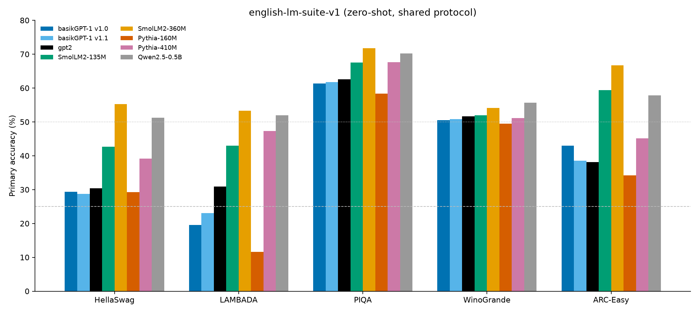
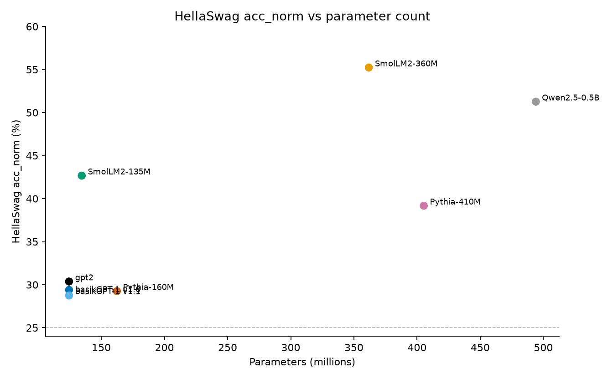

# basikGPT-1 ホワイトペーパー

[English](whitepaper.md) · **日本語** · [한국어](whitepaper.ko.md)

| | |
| --- | --- |
| Authors | basikGPT Contributors |
| Document version | 1.0 |
| Date | 2026-08-29 |
| Package | `basikgpt` 0.1.0 |
| Production runs | `main_2p5b` (38,147 steps) → `cont_5b_mix` (76,294 steps) |
| Weights | [`project-iconik/basikGPT-1-v1.0`](https://huggingface.co/project-iconik/basikGPT-1-v1.0), [`project-iconik/basikGPT-1-v1.1`](https://huggingface.co/project-iconik/basikGPT-1-v1.1) |
| Code | [`project-iconik/basikGPT`](https://github.com/project-iconik/basikGPT) |

本技術ホワイトペーパーは **basikGPT-1** のアーキテクチャ、トークナイザ、データミックス、完了した 2 本の本番事前学習、言語モデル指標、およびゼロショット English LM suite 比較を記録する。

2.5B ランの機械可読表は [`runs/main_2p5b/WHITEPAPER.md`](../runs/main_2p5b/WHITEPAPER.md) にある。本文は両チェックポイントの叙述記録である。

---

## 目次

1. [要旨](#1-要旨)
2. [導入](#2-導入)
3. [関連研究](#3-関連研究)
4. [モデル](#4-モデル)
5. [トークナイザ](#5-トークナイザ)
6. [データ](#6-データ)
7. [学習](#7-学習)
8. [計算資源](#8-計算資源)
9. [言語モデル結果](#9-言語モデル結果)
10. [English LM suite](#10-english-lm-suite)
11. [想定用途・限界・ライセンス](#11-想定用途限界ライセンス)
12. [再現性](#12-再現性)
13. [結論](#13-結論)
14. [参考文献](#14-参考文献)
15. [付録](#appendix)

---

## 1. 要旨

basikGPT-1 は PyTorch でゼロから学習した **124,439,808** パラメータの GPT-2 Small decoder-only Transformer である。本番 2 段階はいずれも単一の NVIDIA RTX PRO 4500 Blackwell 上で実行した。

- **v1.0** (`main_2p5b`): FineWeb-Edu **2,500,001,792** トークン（約 **20.09** tokens/parameter）を **29,462.59 s**（8.18 GPU hours）。学習後の full validation 交差エントロピー / perplexity は **3.2548 / 25.9151**。プロトコル上の HellaSwag `acc_norm` は **29.40%**。
- **v1.1** (`cont_5b_mix`): v1.0 を FineWeb 2.25B + OpenWebMath 0.25B でさらに 2.5B トークン継続。生涯トークン **5,000,003,584**（約 **40.18** tokens/parameter）。この段階の壁時計は **29,593.20 s**（8.22 GPU hours）。LAMBADA は **+3.47 pp**、ARC-Easy は **−4.50 pp**。

重みは Hugging Face Hub 上の `GPT2LMHeadModel` 出力である: [`project-iconik/basikGPT-1-v1.0`](https://huggingface.co/project-iconik/basikGPT-1-v1.0) と [`project-iconik/basikGPT-1-v1.1`](https://huggingface.co/project-iconik/basikGPT-1-v1.1)。

本モデルは事前学習済み **base** であり、instruction-tuned なチャットボットではない。比較表は共有プロトコルのベースラインであり、計算資源を揃えたうえで GPT-2 Small を上回ったという主張ではない。

---

## 2. 導入

公開 GPT-2 Small チェックポイントは存在する。しかし参照ロジットパリティ付きアーキテクチャ、文書化された公開コーパスパイプライン、packed uint16 シャード、凍結済み単一 GPU レシピ、リポジトリ内評価スイートという一式は、教育とリバースエンジニアリングにまだ有用である。

basikGPT-1 は次の 3 制約のもとゼロから学習した。

- **アーキテクチャ忠実性。** デコーダは GPT-2 Small と一致する: 12 Pre-Norm ブロック、12 heads、`d_model` 768、学習済み絶対位置、LayerNorm、GPT-2 GELU、tied embeddings、bias。公式 `openai-community/gpt2` 重みは変換経路で読み込まれ、文書化された許容誤差内でロジットが一致する。
- **第 1 段階は Chinchilla 近傍のユニークデータ。** Hoffmann et al. はおおよそ 20 tokens/parameter を示唆する。v1.0 は 124.4M ユニークパラメータに対し FineWeb-Edu (`sample-10BT`) を 1 回だけ見た 2.50B トークンを用いた。
- **単一 24–32 GB GPU。** 系列長 1024、micro-batch 8、gradient accumulation 8、BF16、SDPA により実測割り当ては約 9.5 GiB に収まる。

第 2 段階は文書化された継続学習であり、2 本目のゼロからの学習ではない。SmolLM `python-edu` を含む初期ミックス案は **実行していない**。v1.1 は FineWeb + OpenWebMath のみである。

---

## 3. 関連研究

バックボーンは GPT-2 [Radford et al., 2019] に従う: Pre-Norm 残差ブロック、学習済み絶対位置埋め込み、因果的 multi-head self-attention、tied embedding / LM head。学習スタックは近代化されている（AdamW、cosine decay、BF16、PyTorch SDPA）ものであり、TensorFlow 1.x / WebText の複製ではない。忠実性の階層は [`docs/pretraining_recipe.md`](pretraining_recipe.md) に記す。

第 1 段階のトークン予算は Chinchilla の計算最適比（おおよそ 20 tokens/parameter）[Hoffmann et al., 2022] に従う。実行された v1.0 比は FineWeb-Edu 2.5B トークン 1 パスで 20.09 tokens/parameter である。

事前学習データは v1.0 が FineWeb-Edu [Penedo et al. / HuggingFaceFW]、継続が FineWeb と OpenWebMath [Paster et al.] である。詳細とライセンスは [§6](#6-データ) と [§11](#11-想定用途限界ライセンス) にある。

評価側では公式 GPT-2 Small が同一アーキテクチャの参照である。Pythia [Biderman et al., 2023]、SmolLM2、Qwen2.5-0.5B はリポジトリ内プロトコル `english-lm-suite-v1` で測定し、論文掲載値は混ぜない。トークン数とアーキテクチャは **揃えていない**。共有採点規則のもとでのベースラインであり、公平な計算資源比較ではない。

---

## 4. モデル

プリセットは `src/basikgpt/config.py` の `gpt2_small`。GPT-2 因果デコーダ: トークン埋め込み、学習済み位置埋め込み、12 個の Pre-Norm Transformer ブロック、最終 LayerNorm、LM head。LM head 重みは埋め込み行列と同一（`tie_word_embeddings=true`）なので 50,257 × 768 表は 1 回だけ数える（**38,597,376** ユニークパラメータ）。分解は [付録](#a1-ユニークパラメータ分解) にある。

| Field | Value |
| --- | --- |
| Unique parameters | 124,439,808 |
| `vocab_size` | 50,257 |
| `d_model` (`hidden_size`) | 768 |
| `n_layers` | 12 |
| `n_heads` | 12 |
| `head_dim` | 64 |
| `d_ff` (`intermediate_size`) | 3,072 |
| `context_length` | 1,024 |
| LayerNorm `eps` | 1e-5 |
| Attention / MLP / LayerNorm bias | true (`lm_head` bias false) |
| `tie_word_embeddings` | true |
| Activation | GELU tanh approximation |
| Position encoding | learned absolute |
| Attention | causal multi-head self-attention (not GQA) |
| Training sequence length | **1024** |
| Training dropout | **0.0** (`GPTConfig` default is 0.1; pretraining CLIs override) |

**なぜこの選択か。** 参照パリティ検証まで 2019 GPT-2 Small トポロジを凍結する。残差射影は GPT-2 のスケール初期化 `std = 0.02 / sqrt(2 * n_layers)` を使う。Attention はスケール `1/sqrt(64)` の scaled dot-product である。学習は SDPA バックエンド、検証用に eager 経路がある。

**文脈長。** 位置は 1024 のみ割り当て・学習する。RoPE 表も、未使用の長文脈予約もない。

---

## 5. トークナイザ

GPT-2 byte-level BPE（`tiktoken.get_encoding("gpt2")`）。語彙 50,257。End-of-text id **50,256**。独自トークナイザは使わない。

学習取り込みは文書本文に `encode_ordinary()` を使い（ページ中のリテラル `<|endoftext|>` は通常バイト）、文書境界として EOT を 1 個付与する。マニフェストは `special_token_policy: encode_ordinary + appended EOT` と記録する。学習機の tiktoken は `0.14.0` だった。

Hub 出力は公式 GPT-2 トークナイザファイルを `GPT2LMHeadModel` safetensors と並べて出すので、`transformers.AutoTokenizer` は同じ BPE を読む。

---

## 6. データ

Hub ストリームはリポジトリパイプライン（`scripts/prepare_fineweb_edu.py`、`scripts/prepare_hf_corpus.py`）とトークン予算を使う。文書はトークン化し、目標 1,000,000 トークンの **uint16** `.npy` シャードにパックし、SHA-256 でチェックサムする。train/validation 分割は `sha256-hash-bucket-v1`（salt `basikgpt-fineweb-edu-v1`）。シャードは逐次読み（`--no-shuffle`）なので実行プレフィックスは再現できる。

### 6.1 v1.0 ミックス (`main_2p5b`)

`HuggingFaceFW/fineweb-edu` `sample-10BT`、revision `87f09149ef4734204d70ed1d046ddc9ca3f2b8f9`、ライセンス **ODC-By 1.0**。ローカルシャード: `data/fineweb-edu-2p5b/`。

| Manifest field | Value |
| --- | --- |
| Train / validation documents | 2,421,794 / 5,007 |
| Train / validation tokens | 2,499,999,466 / 4,986,319 |
| Train / validation shards | 2,500 / 5 |
| Packed train sequences (T=1024) | 2,440,000 |
| Discarded train tail tokens | 1,436,966 |
| Validation fraction | 0.005 |

v1.0 は 2,500,000,000 トークンを要求し、実行は **2,500,001,792**（+1,792 overshoot; 38,147 × 65,536）。

### 6.2 v1.1 継続ミックス (`cont_5b_mix`)

この段階後の生涯ミックス: FineWeb-Edu **50%** + FineWeb **45%** + OpenWebMath **5%**。継続自体は FineWeb 2.25B + OpenWebMath 0.25B で、オフラインに **1 OpenWebMath シャード + 9 FineWeb シャード / 周期**、その後 FineWeb テール（`math1_fineweb9`）。validation は v1.0 の FineWeb-Edu holdout のまま。

| Source | Hub | Revision | Tokens in this stage |
| --- | --- | --- | --- |
| FineWeb | `HuggingFaceFW/fineweb` `sample-10BT` | `9bb295ddab0e05d785b879661af7260fed5140fc` | 2,249,995,296 (2,250 shards) |
| OpenWebMath | `open-web-math/open-web-math` | `fde8ef8de2300f5e778f56261843dab89f230815` | 249,999,979 (250 shards) |
| **Stage train total** | | | **2,499,995,275** |

SmolLM `python-edu` を 10% 入れる草案は **実行していない**。v1.1 にコード切片はない。

0.25B の数学切片は数式が未知分布にならないためである。数学モデルを主張できる量ではなく、GSM8K は評価プロトコルにない。

---

## 7. 学習

設定凍結: [`configs/gpt2_small_fineweb_edu_single_gpu.json`](../configs/gpt2_small_fineweb_edu_single_gpu.json)（provisional）。`scripts/train.py` はその JSON を読まない。本番は同等 CLI フラグを使った。正典レシピは Candidate A（`compile=false`、B=8、G=8）。

optimizer step あたりトークンは常に `8 × 8 × 1024` = **65,536**。

### 7.1 Stage v1.0

| Item | Value |
| --- | --- |
| `max_steps` | 38,147 |
| Token budget (executed) | 2,500,001,792 |
| `sequence_length` | 1024 |
| `micro_batch_size` × `gradient_accumulation_steps` | 8 × 8 |
| Optimizer | AdamW |
| `learning_rate` / `min_lr` | 6e-4 / 6e-5 |
| Warmup / schedule | 2,000 linear warmup, then cosine |
| `betas` / `eps` | [0.9, 0.95] / 1e-8 |
| `weight_decay` | 0.1 on rank-2 matrices (124,318,464 params); 0 on 1D (121,344) |
| `max_grad_norm` | 1.0 |
| `precision` | bf16 |
| `sdpa_kernel` | auto |
| `compile` | false |
| `seed` | 1337 |
| `eval_interval` / `eval_tokens` | 1,526 / 131,072 |
| Checkpoint steps | 1,526, 7,630, 15,259, 38,147 |

AdamW グループは tied パラメータの重複を除き、`wte` と `lm_head` を二重減衰しない。

### 7.2 Stage v1.1

`runs/main_2p5b/step-00038147.pt` から重みと optimizer を再開。`schedule_origin_step` 38,147。初回 resume は `--reset-data-index` で新しいミックスを sample 0 から始める。

| Item | Value |
| --- | --- |
| Final step | 76,294 |
| Lifetime tokens | 5,000,003,584 (+3,584 overshoot) |
| This-stage steps / tokens | 38,147 / 2,500,001,792 |
| LR | rewarm 6e-5 → 3e-4 over 1,000 steps, then cosine to 6e-5 |
| Other optimizer / batch fields | same as v1.0 |
| `seed` | 1337 |

**FineWeb-Edu を 1 epoch 見たあと、別ミックスへ。** 継続は意図して Edu 分布を離れる。v1.1 中の FineWeb-Edu validation CE 上昇は想定内であり、静かな劣化ではない。

---

## 8. 計算資源

| Field | v1.0 | v1.1 (this stage) |
| --- | --- | --- |
| GPU | NVIDIA RTX PRO 4500 Blackwell | same |
| VRAM | 33,685,569,536 bytes (~31.37 GiB) | same |
| PyTorch / CUDA (torch) / driver | 2.8.0+cu128 / 12.8 / 580.159.04 | same |
| Cloud | RunPod | RunPod |
| Wall-clock (s) | 29,462.59 | 29,593.20 |
| GPU hours | 8.1841 | 8.2203 |
| Training-only tok/s | 85,076 | ~84,700 |
| Peak CUDA allocated (MiB) | 9,523.61 | 9,528.69 |

v1.1 `summary.json` の `training_only_tokens_per_sec` は **169,416** である。これは **生涯** 5.0B トークンをこの段階の学習時間で割った値であり、スループット測定ではない。段階トークン 2,500,001,792 / `train_elapsed_seconds` 29,513.24 s ≈ **84,708** tok/s で、v1.0 と整合する。

ピーク割り当ては約 9.5 GiB に留まるので、このバッチ形状では 24 GB カードに余裕がある。Hub 取り込みとシャードパックの壁時計は step 1 以前であり、GPU-hour 合計に含まない。

---

## 9. 言語モデル結果

`train.py` のあと、`scripts/write_whitepaper_snapshot.py` が v1.0 のコピー用表を `training_log` / `metrics.jsonl` から書いた。以下の数値はそのスナップショットと学習後評価 JSON から取る。**ループ内 validation は 131,072 トークン**であり、packed validation 全体ではない。

一様語彙参照: ln(50,257) ≈ **10.8249**。train loss は step 1 でその線付近（10.9094）から始まり、3.28 まで下がる。

### 9.1 v1.0 学習曲線

| Metric | Value | Step |
| --- | --- | --- |
| first train loss | 10.9094 | 1 |
| last train loss | 3.2830 | 38,147 |
| min in-loop val CE / PPL | 3.3052 / 27.2551 | 36,624 |
| full val CE / PPL | 3.2548 / 25.9151 | 38,147 (post-hoc) |
| tokens processed | 2,500,001,792 | |
| wall time (s) | 29,462.59 | |

### 9.2 v1.0 チェックポイント梯子（事後）

Full FineWeb-Edu validation と HellaSwag validation は、番号付き 4 チェックポイントに対し学習 **後** に測定した。学習ループ内ではない。`step-final.pt` は step 38,147 と一致する。

| Step | Tokens (approx.) | Full val CE / PPL | HellaSwag acc_raw | HellaSwag acc_norm |
| --- | ---: | ---: | ---: | ---: |
| 1,526 | 100M | 4.701 / 110.05 | 26.38% | 25.05% |
| 7,630 | 500M | 3.660 / 38.86 | 26.76% | 27.16% |
| 15,259 | 1B | 3.479 / 32.43 | 27.20% | 27.71% |
| 38,147 | 2.5B | 3.255 / 25.92 | 28.10% | **29.33%** |

後続の `english-lm-suite-v1` 再採点では同じ 2.5B チェックポイントの HellaSwag `acc_norm` は **29.40%**（2,952 / 10,042）。29.33% は先行の単独 HellaSwag ダンプ（`hellaswag-step-00038147.json`）である。第 10 節はスイート値をプロトコル公式点とする。

### 9.3 v1.1 学習曲線

validation は FineWeb-Edu のままで、train は Edu を離れる。

| Metric | Value | Step |
| --- | --- | --- |
| first train loss (this stage) | 3.8090 | 38,150 |
| last train loss | 3.5349 | 76,294 |
| min in-loop val CE / PPL | 3.3214 / 27.6990 | 38,150 |
| final in-loop val CE | 3.4710 | 76,294 |
| lifetime tokens | 5,000,003,584 | |

Edu val CE の 3.32 → 3.47 上昇は想定された分布シフトである。v1.1 には `runs/cont_5b_mix/` 内の事後 full-val / HellaSwag-step JSON がない。そのチェックポイントの下流点は [`benchmarks/`](../benchmarks/) のみにある。

---

## 10. English LM suite

事前学習後、両チェックポイントをプロトコル **`english-lm-suite-v1`** でゼロショット採点した。split・プロンプト・採点式は [`benchmarks/REPORT.md`](../benchmarks/REPORT.md) と `src/basikgpt/evaluation/` に凍結されている。lm-eval-harness は依存しない。他論文の掲載値は混ぜない。

トークナイザと事前学習データはモデルごとに異なる。**共有プロトコルのもとでのベースラインである。**

| Task | Split | Primary metric | n | Chance (not subtracted) |
| --- | --- | --- | ---: | --- |
| HellaSwag | validation | acc_norm (mean completion LL) | 10,042 | 25% |
| LAMBADA (OpenAI) | test | last-word greedy accuracy | 5,153 | open-vocab |
| PIQA | validation (`baber/piqa`) | acc_norm | 1,838 | 50% |
| WinoGrande | validation (`winogrande_xl`) | acc_raw | 1,267 | 50% |
| ARC-Easy | test | acc_norm | 2,376 | 1/N (typically 25%) |

多肢選択は context と `" " + ending` を別エンコードし連結し、必要なら context を左切り詰め、**choice トークンのみ**を採点する。`acc_raw` は対数尤度の和、`acc_norm` は平均。LAMBADA は最後の空白で分割し、末尾語全体の greedy トークン一致を要求する。

2 本の forward 経路はプロンプトと argmax 規則を共有する: GPT-2 経路（basikGPT `.pt` と公式 `gpt2`、tiktoken `gpt2`）と、SmolLM2 / Pythia / Qwen 向け `AutoModelForCausalLM`。トークン化は揃えていないので、点はプロトコル比較であり、トークン一致 perplexity ではない。

チェックポイント: v1.0 `runs/main_2p5b/step-00038147.pt`、v1.1 `runs/cont_5b_mix/step-00076294.pt`。中間 100M / 500M / 1B はこのスイートにない。

| Model | Params | Corpus | HS acc_norm | LAMBADA | PIQA | WG | ARC-E |
| --- | ---: | --- | ---: | ---: | ---: | ---: | ---: |
| **basikGPT-1 v1.0** | 124M | FineWeb-Edu 2.5B | **29.40%** | **19.58%** | **61.37%** | **50.51%** | **43.01%** |
| **basikGPT-1 v1.1** | 124M | Edu 2.5B + FineWeb 2.25B + OpenWebMath 0.25B | **28.75%** | **23.05%** | **61.75%** | **50.83%** | **38.51%** |
| `openai-community/gpt2` | 124M | WebText | 30.37% | 30.93% | 62.57% | 51.62% | 38.13% |
| SmolLM2-135M | 135M | SmolLM2 mix | 42.67% | 42.97% | 67.57% | 51.93% | 59.43% |
| SmolLM2-360M | 362M | SmolLM2 mix | 55.23% | 53.25% | 71.71% | 54.14% | 66.75% |
| Pythia-160M | 162M | The Pile | 29.26% | 11.57% | 58.32% | 49.49% | 34.22% |
| Pythia-410M | 405M | The Pile | 39.18% | 47.33% | 67.68% | 51.14% | 45.12% |
| Qwen2.5-0.5B | 494M | Qwen2.5 mix | 51.26% | 51.99% | 70.18% | 55.64% | 57.83% |

WG は acc_raw、他列はスイートの primary metric。





**点数の読み方。**

- **v1.1 vs v1.0。** LAMBADA **+3.47 pp**（19.58 → 23.05）: FineWeb 散文が last-word 予測を意図した方向へ動かした。ARC-Easy **−4.50 pp**（43.01 → 38.51）: Edu に揃っていた科学問題の優位は薄れた。HellaSwag −0.65 pp。PIQA と WinoGrande の変動は 0.4 pp 未満。
- **公式 GPT-2 Small 対比。** 同じデコーダ、同じ tiktoken、同じ completion NLL。primary で gpt2 を上回るのは v1.0 の ARC-Easy **+4.88 pp** のみ。LAMBADA は大きく下回る（v1.0 −11.35 pp、v1.1 −7.88 pp）。HellaSwag はわずかに下（v1.0 −0.97 pp、v1.1 −1.62 pp）。
- **HellaSwag ~29%。** 偶然 25% より上、gpt2 と Pythia-160M と同じ帯、SmolLM2-135M の 42.67% より大きく下。近いパラメータ数が近いデータ予算を意味しない。
- **WinoGrande。** 8 モデルすべて 49.5–55.6%。n=1,267 で 50% の標準誤差は約 1.4 pp なので、50.51% と 50.83% は偶然と区別できない。
- **規模の梯子。** SmolLM2-360M と Qwen2.5-0.5B は 124M GPT-2 クラスより明確に上。想定されるミックスとスケールの差であり、驚きではない。

**この数字でしない主張。** ハイパーパラメータ探索は終わっていない。表はトークン一致でも計算資源一致の比較でもない。「GPT-2 に勝った」は見出しとして誤りである。2.5B と 5B は **学習トークン**でありパラメータではない。0.25B OpenWebMath は GSM8K を意味しない（プロトコルにない）。KoBEST、MMLU、HumanEval、WikiText PPL はスイートにない。

公開スコア: [`benchmarks/REPORT.md`](../benchmarks/REPORT.md) と [`benchmarks/summary.json`](../benchmarks/summary.json)。図の再生成: `python scripts/plot_lm_suite_compare.py`。

---

## 11. 想定用途・限界・ライセンス

### 想定用途

basikGPT-1 は研究・教育・追加事前学習・ファインチューニング向けの英語 **base** チェックポイントである。チャットボットではなく、instruction-tuned でもない。開放的な本番チャットには安全ではない。

アーキテクチャとトークナイザは GPT-2 互換である。`transformers.AutoModelForCausalLM.from_pretrained` は Hub 出力を **読み込める**:

```python
from transformers import AutoModelForCausalLM, AutoTokenizer

tok = AutoTokenizer.from_pretrained("project-iconik/basikGPT-1-v1.1")
model = AutoModelForCausalLM.from_pretrained("project-iconik/basikGPT-1-v1.1")
```

ネイティブ `.pt` は `basikgpt` パッケージで読む。Hub スナップショットは `GPT2LMHeadModel` safetensors と公式 GPT-2 トークナイザファイルである。optimizer 状態は含まない。

### 限界

- 124M / 2.5B–5B トークンでは、より大きなミックスで学習した現代 135M モデルに届かない。
- ミックスは英語中心のウェブテキストと小さな数学切片である。書籍専用コーパス、対話、instruction、選好学習はない。
- ループ内 validation CE/PPL は 131,072 トークンの部分集合であり、packed validation 全体ではない。
- FineWeb-Edu / FineWeb ストリームは逐次プレフィックス（`--no-shuffle`）であり、全クロールの無作為標本ではない。
- PII 処理は上流 FineWeb / FineWeb-Edu / OpenWebMath パイプラインが既に適用したものに依存する。
- 学習文脈は 1024 トークン。
- v1.1 の FineWeb-Edu val CE は val が Edu のままなので v1.0 より悪い。
- 自由生成サンプルはこの文書用に保存していない。

### ライセンス

コードと出力重みは **Apache-2.0**。学習データにはデータセットカードがなお適用される。再配布前に各カードを確認すること。

| Source | License note |
| --- | --- |
| FineWeb-Edu | ODC-By 1.0 |
| FineWeb | ODC-By 1.0 |
| OpenWebMath | see Hub dataset card |
| GPT-2 tokenizer / architecture | follows the public GPT-2 artifacts |

本文書は新たなライセンスを選ばない。

---

## 12. 再現性

| Step | Path |
| --- | --- |
| Architecture / config | `src/basikgpt/config.py` (`gpt2_small`) |
| Frozen single-GPU JSON | `configs/gpt2_small_fineweb_edu_single_gpu.json` |
| FineWeb-Edu ingest | `scripts/prepare_fineweb_edu.py` → `data/fineweb-edu-2p5b/` |
| HF corpus ingest | `scripts/prepare_hf_corpus.py` |
| Mix interleave | `scripts/combine_shards.py` → `data/mix_5b_cont/` |
| v1.0 train | `python scripts/train.py` with the CLI in [`docs/main_2p5b.md`](main_2p5b.md) |
| v1.1 train | resume from `runs/main_2p5b/step-00038147.pt`; see `runs/cont_5b_mix/run.json` |
| Full val CE/PPL | `scripts/evaluate.py` |
| HellaSwag (standalone) | `scripts/evaluate_hellaswag.py` |
| English suite | `scripts/evaluate_lm_suite.py` |
| HF export | `scripts/export_hf.py` |
| Snapshot tables | `scripts/write_whitepaper_snapshot.py` |
| Suite figures | `scripts/plot_lm_suite_compare.py` |

v1.0 学習 CLI:

```bash
python scripts/train.py \
  --model-preset gpt2_small --device cuda --precision bf16 \
  --batch-size 8 --grad-accum-steps 8 \
  --target-tokens 2500000000 \
  --warmup-steps 2000 --lr 6e-4 --min-lr 6e-5 \
  --eval-at-start --eval-tokens 131072 --eval-interval 1526 \
  --log-interval 10 \
  --checkpoint-steps 1526,7630,15259,38147 \
  --no-shuffle --track-data-index \
  --data-dir data/fineweb-edu-2p5b \
  --output-dir runs/main_2p5b
```

スイート:

```bash
python scripts/evaluate_lm_suite.py --checkpoint runs/main_2p5b/step-00038147.pt
python scripts/evaluate_lm_suite.py --checkpoint runs/cont_5b_mix/step-00076294.pt --model-id basikgpt-5b
python scripts/evaluate_lm_suite.py --protocol-all --device cuda
python scripts/plot_lm_suite_compare.py
```

`data/` 下の大きなシャードと `runs/` 下の `.pt` は gitignore される。本番 2.5B 取り込みはディスクと Hub ストリームを要し、ノート PC の既定ではない。

記録された git SHA（いずれも dirty）:

| Artifact | Commit |
| --- | --- |
| v1.0 train / post-hoc val | `95e63c325591a96c1a71a288f03742049a589d04` |
| v1.1 train / english-lm-suite-v1 | `ff8b2c0284668c3333d268b27864460e2b1db5f7` |

dirty ツリーは SHA が来歴であり、ビット単位のレシピロックではないことを意味する。

---

## 13. 結論

basikGPT-1 は完結した GPT-2 Small 事前学習である: 検証済み 124,439,808 パラメータデコーダ、GPT-2 BPE、文書化された FineWeb-Edu 2.5B 段階（20.09 tokens/parameter、8.18 GPU hours、full-val PPL 25.92）、文書化された FineWeb+OpenWebMath 5B 継続、リポジトリ内ゼロショット英語スイート。

v1.0 は HellaSwag で公式 gpt2 の隣、ARC-Easy では上、LAMBADA が最大の差である。v1.1 はその LAMBADA 差の一部を埋め、ARC-Easy の優位を返す。本プロトコルの同規模公開デコーダは近く、より大きな現代ミックスで学習した 135M–0.5B は上にいる。想定される規模とデータの梯子であり、驚きではない。

---

## 14. 参考文献

- Radford, A., et al. (2019). *Language Models are Unsupervised Multitask Learners.* OpenAI.
- Hoffmann, J., et al. (2022). *Training Compute-Optimal Large Language Models* (Chinchilla). arXiv:2203.15556.
- Biderman, S., et al. (2023). *Pythia: A Suite for Analyzing Large Language Models Across Training and Scaling.* arXiv:2304.01373.
- HuggingFaceFW. *FineWeb-Edu* (`sample-10BT`). https://huggingface.co/datasets/HuggingFaceFW/fineweb-edu
- HuggingFaceFW. *FineWeb.* https://huggingface.co/datasets/HuggingFaceFW/fineweb
- Paster, K., et al. *OpenWebMath.* https://huggingface.co/datasets/open-web-math/open-web-math
- OpenAI. *GPT-2 Small.* https://huggingface.co/openai-community/gpt2
- HuggingFaceTB. *SmolLM2.* https://huggingface.co/HuggingFaceTB/SmolLM2-135M
- Alibaba. *Qwen2.5-0.5B.* https://huggingface.co/Qwen/Qwen2.5-0.5B
- Zellers, R., et al. (2019). *HellaSwag: Can a Machine Really Finish Your Sentence?* ACL.
- Paperno, D., et al. (2016). *The LAMBADA dataset.*
- Bisk, Y., et al. (2020). *PIQA: Reasoning about Physical Commonsense in Natural Language.*
- Sakaguchi, K., et al. (2020). *WinoGrande.*
- Clark, P., et al. (2018). *Think you have Solved Question Answering? Try ARC.*
- basikGPT-1 v1.0 weights. https://huggingface.co/project-iconik/basikGPT-1-v1.0
- basikGPT-1 v1.1 weights. https://huggingface.co/project-iconik/basikGPT-1-v1.1
- basikGPT code. https://github.com/project-iconik/basikGPT

スイートプロトコル: [`benchmarks/REPORT.md`](../benchmarks/REPORT.md)。機械可読ロールアップ: [`benchmarks/summary.json`](../benchmarks/summary.json)。

```
@software{basikgpt,
  title = {basikGPT},
  author = {basikGPT Contributors},
  url = {https://github.com/project-iconik/basikGPT},
  year = {2026}
}
```

---

## Appendix

### A.1 ユニークパラメータ分解

tied 入力埋め込み / LM head は 1 回だけ数える。`lm_head`（bias false）を除き Linear と LayerNorm の bias を含む。

| Block | Count |
| --- | ---: |
| Token embedding 50,257 × 768 (tied with LM head) | 38,597,376 |
| Position embedding 1,024 × 768 | 786,432 |
| 12 × attention (Q/K/V/O 768×768 + bias) | 28,348,416 |
| 12 × MLP (768↔3072 + bias) | 56,669,184 |
| 12 × 2 LayerNorm (768+768) + final LayerNorm | 38,400 |
| **Unique total** | **124,439,808** |

untied 合計は 163,037,184。実測ユニークパラメータ数はこの表と一致する。
