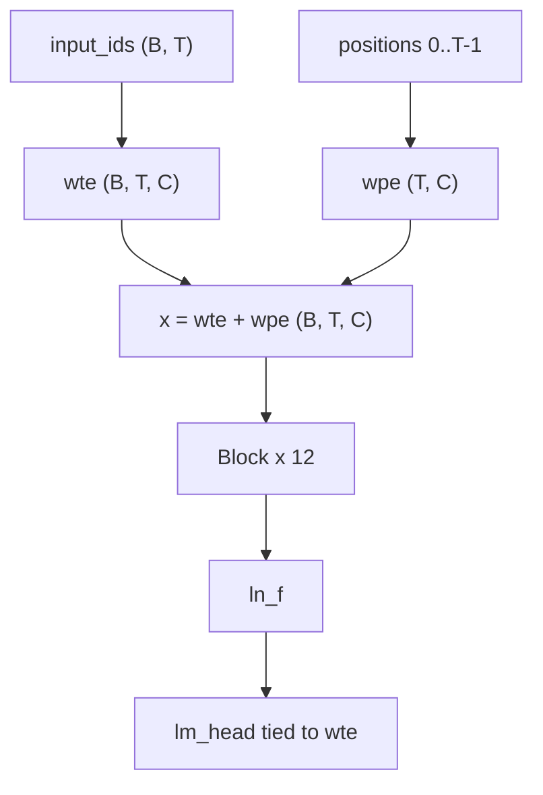
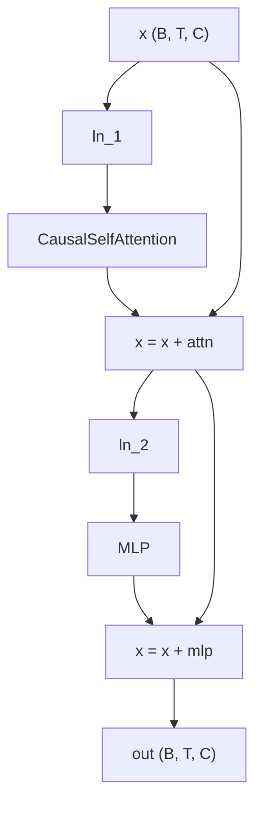
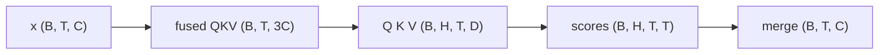
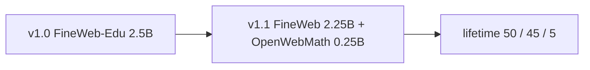
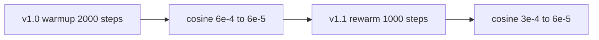

# basikGPT-1 ホワイトペーパー

[English](whitepaper.md) · **日本語** · [한국어](whitepaper.ko.md)

| | |
| --- | --- |
| 著者 | basikGPT Contributors |
| 文書バージョン | 1.1 |
| 日付 | 2026-08-29 |
| パッケージ | `basikgpt` 0.1.0 |
| 本番学習 | `main_2p5b`（38,147 ステップ）→ `cont_5b_mix`（76,294 ステップ） |
| 重み | [`project-iconik/basikGPT-1-v1.0`](https://huggingface.co/project-iconik/basikGPT-1-v1.0)、[`project-iconik/basikGPT-1-v1.1`](https://huggingface.co/project-iconik/basikGPT-1-v1.1) |
| コード | [`project-iconik/basikGPT`](https://github.com/project-iconik/basikGPT) |

本技術ホワイトペーパーは、**basikGPT-1** のアーキテクチャ、トークナイザ、データ構成、完了した 2 段階の本番事前学習、言語モデル指標、およびゼロショット英語言語モデル評価スイートの比較を記録する。

2.5B 学習の機械生成スナップショット表は [`runs/main_2p5b/WHITEPAPER.md`](../runs/main_2p5b/WHITEPAPER.md) にある。本書は、両チェックポイントを包括的に扱う技術報告書である。

---

## 目次

1. [要旨](#1-要旨)
2. [はじめに](#2-はじめに)
3. [関連研究](#3-関連研究)
4. [モデル](#4-モデル)
5. [トークナイザ](#5-トークナイザ)
6. [データ](#6-データ)
7. [学習](#7-学習)
8. [計算資源](#8-計算資源)
9. [言語モデル結果](#9-言語モデル結果)
10. [英語言語モデル評価スイート](#10-英語言語モデル評価スイート)
11. [想定用途・限界・ライセンス](#11-想定用途限界ライセンス)
12. [再現性](#12-再現性)
13. [結論](#13-結論)
14. [参考文献](#14-参考文献)
15. [付録](#appendix)

---

## 1. 要旨

basikGPT-1 は PyTorch でゼロから学習した **124,439,808** パラメータの GPT-2 Small decoder-only Transformer である。2 段階の本番事前学習は、いずれも単一の NVIDIA RTX PRO 4500 Blackwell 上で実行した。

- **v1.0** (`main_2p5b`): FineWeb-Edu **2,500,001,792** トークン（1 パラメータあたり約 **20.09** トークン）を **29,462.59 秒**（8.18 GPU 時間）かけて学習した。学習後の全検証における交差エントロピーとパープレキシティは、それぞれ **3.2548** と **25.9151** であった。評価スイートのプロトコルで測定した HellaSwag `acc_norm` は **29.40%** であった。
- **v1.1** (`cont_5b_mix`): v1.0 のチェックポイントから、FineWeb 2.25B + OpenWebMath 0.25B でさらに 2.5B トークンの継続学習を行った。累計トークン数は **5,000,003,584**（1 パラメータあたり約 **40.18** トークン）に達した。この段階の実経過時間は **29,593.20 秒**（8.22 GPU 時間）であった。LAMBADA は **+3.47 pp** 上昇し、ARC-Easy は **−4.50 pp** 低下した。

重みは `GPT2LMHeadModel` 形式で Hugging Face Hub に公開している: [`project-iconik/basikGPT-1-v1.0`](https://huggingface.co/project-iconik/basikGPT-1-v1.0) と [`project-iconik/basikGPT-1-v1.1`](https://huggingface.co/project-iconik/basikGPT-1-v1.1)。

本モデルは事前学習済みの **ベース（base）モデル**である。比較表は共通プロトコルに基づくベースライン評価である。

---

## 2. はじめに

公開 GPT-2 Small チェックポイントは既に存在する。しかし、参照モデルとのロジット一致を検証したアーキテクチャ、文書化された公開コーパスパイプライン、パック済み uint16 シャード、記録された単一 GPU 学習レシピ、リポジトリ内評価スイートをまとめた一連のスタックは、教育やリバースエンジニアリングにおいて依然として高い価値を持つ。

basikGPT-1 は、次の 3 つの制約のもとでゼロから学習した。

- **アーキテクチャ忠実性。** デコーダは GPT-2 Small と同じく、12 個の事前正規化ブロック、12 個のアテンションヘッド、`d_model` 768、学習可能な絶対位置埋め込み、LayerNorm、GPT-2 GELU、共有埋め込み、バイアスを使用する。公式 `openai-community/gpt2` の重みは変換経路で読み込むことができ、ロジットは文書化された許容誤差内で一致する。
- **第 1 段階における Chinchilla の計算最適比に近いデータ量。** Hoffmann et al. は、1 パラメータあたり約 20 トークンを示唆している。v1.0 は、124.4M 個の固有パラメータに対し、FineWeb-Edu (`sample-10BT`) を 1 回順次通過して 2.50B トークンを使用した。
- **単一の 24–32 GB GPU。** 系列長 1024、マイクロバッチ 8、勾配累積 8、BF16、SDPA を使用し、実測最大メモリ割り当て量は約 9.5 GiB に収まった。

第 2 段階は、文書化された継続学習である。SmolLM `python-edu` を含む初期データ構成案は **実行していない**。v1.1 には FineWeb と OpenWebMath のみを使用した。

---

## 3. 関連研究

バックボーンは GPT-2 [Radford et al., 2019] に従い、事前正規化残差ブロック、学習可能な絶対位置埋め込み、因果的マルチヘッド自己注意、入力埋め込みと LM ヘッドの重み共有を使用する。学習スタックには AdamW、コサイン減衰、BF16、PyTorch SDPA などの現代的な手法を採用している。互換性レベルは [`docs/pretraining_recipe.md`](pretraining_recipe.md) に記載する。

第 1 段階のトークン予算は、Chinchilla の計算最適比（1 パラメータあたり約 20 トークン）[Hoffmann et al., 2022] に従う。実際の v1.0 の比率は、FineWeb-Edu 2.5B トークンを 1 回通過した時点で 1 パラメータあたり 20.09 トークンである。

事前学習データには、v1.0 段階で FineWeb-Edu [Penedo et al. / HuggingFaceFW] を、継続学習段階で FineWeb と OpenWebMath [Paster et al.] を使用した。詳細とライセンスは [§6](#6-データ) と [§11](#11-想定用途限界ライセンス) に記載する。

評価では、公式 GPT-2 Small を同一アーキテクチャの参照モデルとした。Pythia [Biderman et al., 2023]、SmolLM2、Qwen2.5-0.5B はリポジトリ内プロトコル `english-lm-suite-v1` で測定し、他の論文に掲載された数値は併用していない。トークン数とアーキテクチャは **揃えていない**。これは共通の採点規則に基づく基準結果である。

---

## 4. モデル

`gpt2_small` プリセットは `src/basikgpt/config.py` に定義されている。GPT-2 因果デコーダは、トークン埋め込み、学習可能な位置埋め込み、12 個の事前正規化 Transformer ブロック、最終 LayerNorm、LM ヘッドで構成される。LM ヘッドの重みは埋め込み行列と共有されるため（`tie_word_embeddings=true`）、50,257 × 768 の重み表は固有パラメータとして 1 回だけ集計される（**38,597,376** パラメータ）。詳細なパラメータ内訳は [付録](#a1-固有パラメータ内訳) に記載する。

| 項目 | 値 |
| --- | --- |
| Unique parameters | 124,439,808 |
| `vocab_size` | 50,257 |
| `d_model` (`hidden_size`) | 768 |
| `n_layers` | 12 |
| `n_heads` | 12 |
| `head_dim` | 64 |
| `d_ff` (`intermediate_size`) | 3,072 |
| `context_length` | 1,024 |
| LayerNorm `eps` | 1e-5 |
| アテンション / MLP / LayerNorm のバイアス | true（`lm_head` のバイアスは false） |
| `tie_word_embeddings` | true |
| Activation | GELU tanh approximation |
| Position encoding | learned absolute |
| Attention | causal multi-head self-attention (not GQA) |
| 学習系列長 | **1024** |
| 学習時のドロップアウト | **0.0**（`GPTConfig` の既定値は 0.1、学習 CLI で上書き） |

**設計選択の背景。** 実装時には、参照モデルとの一致を確立するため、2019 年の GPT-2 Small の原型構造を維持した。残差射影には GPT-2 のスケール調整初期化 `std = 0.02 / sqrt(2 * n_layers)` を使用する。アテンションには、スケール `1/sqrt(64)` のスケールドドット積を使用する。学習には SDPA バックエンドを使用し、検証用に eager 経路も用意している。

**コンテキスト長（Context Length）。** 位置埋め込みは系列長 1024 までに限定して割り当て、学習する。RoPE テーブルや未使用の長いコンテキスト用領域は確保しない。

デコーダスタックの固有パラメータ数は 124,439,808 であり、`tie_word_embeddings=true` を使用する。学習時のドロップアウトは 0.0 であった。



各事前正規化ブロックでは、残差ストリーム自体を残差加算の前に正規化しない: `x = x + attn(ln_1(x))`、続けて `x = x + mlp(ln_2(x))`。



アテンション経路は、スケール `1/sqrt(64)` の因果的マルチヘッドアテンションを使用し、テンソル形状は次のとおりである。



テンソル記号 `B`、`T`、`C`、`H`、`D`、`V` は [`docs/tensor_conventions.md`](tensor_conventions.md) で定義する。

---

## 5. トークナイザ

GPT-2 のバイトレベル BPE（`tiktoken.get_encoding("gpt2")`）を使用する。語彙サイズは 50,257、文書終了トークン ID は **50,256** である。

学習データの取り込みでは、文書本文に `encode_ordinary()` を適用する。このため、文書中のリテラル文字列 `<|endoftext|>` は通常のバイト列としてエンコードされる。各文書境界には EOT トークンを 1 個付与する。マニフェストには `special_token_policy: encode_ordinary + appended EOT` と記録する。学習環境で使用した tiktoken のバージョンは `0.14.0` であった。

Hub エクスポートには、公式 GPT-2 トークナイザファイルを `GPT2LMHeadModel` safetensors とともに同梱するため、`transformers.AutoTokenizer` は同じ BPE を読み込む。

---

## 6. データ

Hub ストリームは、リポジトリのデータパイプライン（`scripts/prepare_fineweb_edu.py`、`scripts/prepare_hf_corpus.py`）と指定されたトークン予算に基づいて処理する。文書をトークン化した後、目標サイズが 1,000,000 トークンの **uint16** `.npy` シャードにパックし、SHA-256 チェックサムを記録する。学習/検証分割には `sha256-hash-bucket-v1`（ソルト `basikgpt-fineweb-edu-v1`）を使用する。シャードを順次読み込むため（`--no-shuffle`）、実際の学習に使用したデータの先頭区間を再現できる。


### 6.1 v1.0 ミックス (`main_2p5b`)

このデータは `HuggingFaceFW/fineweb-edu` の `sample-10BT` 設定から構築した。リビジョンは `87f09149ef4734204d70ed1d046ddc9ca3f2b8f9`、ライセンスは **ODC-By 1.0** であり、ローカルシャードは `data/fineweb-edu-2p5b/` に保存した。

| マニフェスト項目 | 値 |
| --- | --- |
| 学習 / 検証文書 | 2,421,794 / 5,007 |
| 学習 / 検証トークン | 2,499,999,466 / 4,986,319 |
| 学習 / 検証シャード | 2,500 / 5 |
| パック済み学習系列（T=1024） | 2,440,000 |
| 破棄した学習末尾トークン | 1,436,966 |
| 検証比率 | 0.005 |

v1.0 の要求トークン数は 2,500,000,000 であったが、実際には **2,500,001,792** トークンを処理し、目標を 1,792 トークン超過した（38,147 × 65,536）。

### 6.2 v1.1 継続学習データ構成 (`cont_5b_mix`)

この段階後の累積データ構成は、FineWeb-Edu **50%** + FineWeb **45%** + OpenWebMath **5%** である。継続学習段階自体は FineWeb 2.25B + OpenWebMath 0.25B で構成される。オフラインで各周期に **OpenWebMath シャード 1 個 + FineWeb シャード 9 個**を交互配置し、最後に FineWeb 区間を追加した（`math1_fineweb9`）。検証データには v1.0 の FineWeb-Edu ホールドアウトをそのまま使用した。

| ソース | Hub | リビジョン | 本段階のトークン数 |
| --- | --- | --- | --- |
| FineWeb | `HuggingFaceFW/fineweb` `sample-10BT` | `9bb295ddab0e05d785b879661af7260fed5140fc` | 2,249,995,296 (2,250 shards) |
| OpenWebMath | `open-web-math/open-web-math` | `fde8ef8de2300f5e778f56261843dab89f230815` | 249,999,979 (250 shards) |
| **段階学習合計** | | | **2,499,995,275** |

SmolLM `python-edu` を 10% 含める草案は **実行していない**。v1.1 にはプログラミングコードのデータを含めていない。



0.25B の数学データは、数式が学習分布から完全に外れないようにするために含めた。GSM8K は評価プロトコルに含めていない。

---

## 7. 学習

暫定学習レシピのスナップショットは [`configs/gpt2_small_fineweb_edu_single_gpu.json`](../configs/gpt2_small_fineweb_edu_single_gpu.json) に記録している。`scripts/train.py` はこの JSON を直接読み込まず、本番学習では同等の CLI フラグを使用した。基準学習レシピは Candidate A（`compile=false`、B=8、G=8）である。

オプティマイザステップあたりのトークン数は、`8 × 8 × 1024` = **65,536** に固定した。

学習率スケジュールは次のとおりである。v1.0 では 2,000 ステップのウォームアップ後、6e-4 から 6e-5 までコサイン減衰を適用した。v1.1 は 38,147 ステップから再開し、1,000 ステップで 6e-5 から 3e-4 まで再ウォームアップした後、6e-5 までコサイン減衰を適用した。



### 7.1 v1.0 段階

| 項目 | 値 |
| --- | --- |
| `max_steps` | 38,147 |
| 実処理トークン数 | 2,500,001,792 |
| `sequence_length` | 1024 |
| `micro_batch_size` × `gradient_accumulation_steps` | 8 × 8 |
| Optimizer | AdamW |
| `learning_rate` / `min_lr` | 6e-4 / 6e-5 |
| Warmup / schedule | 2,000 ステップの線形ウォームアップ後、コサイン減衰 |
| `betas` / `eps` | [0.9, 0.95] / 1e-8 |
| `weight_decay` | 0.1 on rank-2 matrices (124,318,464 params); 0 on 1D (121,344) |
| `max_grad_norm` | 1.0 |
| `precision` | bf16 |
| `sdpa_kernel` | `auto`（自動選択） |
| `compile` | `false`（無効） |
| `seed` | 1337 |
| `eval_interval` / `eval_tokens` | 1,526 / 131,072 |
| チェックポイントステップ | 1,526, 7,630, 15,259, 38,147 |

AdamW のパラメータグループでは共有パラメータの重複を除外し、`wte` と `lm_head` にウェイト減衰を二重適用しない。

### 7.2 v1.1 段階

`runs/main_2p5b/step-00038147.pt` から重みとオプティマイザ状態を復元して学習を再開した。`schedule_origin_step` は 38,147 であった。継続学習の開始時に `--reset-data-index` を使用し、新しいデータ構成を先頭サンプルから読み込んだ。

| 項目 | 値 |
| --- | --- |
| 最終ステップ | 76,294 |
| 累計トークン数 | 5,000,003,584（目標を 3,584 トークン超過） |
| 本段階のステップ / トークン | 38,147 / 2,500,001,792 |
| LR | 1,000 ステップで 6e-5 → 3e-4 に再ウォームアップ後、6e-5 までコサイン減衰 |
| その他のオプティマイザ / バッチ項目 | v1.0 と同一 |
| `seed` | 1337 |

**FineWeb-Edu を 1 エポック学習した後、別のデータ構成へ移行。** 継続学習段階では、意図的に FineWeb-Edu とは異なるデータ分布を使用した。そのため、v1.1 における FineWeb-Edu 検証 CE の上昇は想定内である。

---

## 8. 計算資源

| 項目 | v1.0 | v1.1（本段階） |
| --- | --- | --- |
| GPU | NVIDIA RTX PRO 4500 Blackwell | 同上 |
| VRAM | 33,685,569,536 bytes (~31.37 GiB) | 同上 |
| PyTorch / CUDA (torch) / driver | 2.8.0+cu128 / 12.8 / 580.159.04 | 同上 |
| Cloud | RunPod | RunPod |
| Wall-clock (s) | 29,462.59 | 29,593.20 |
| GPU hours | 8.1841 | 8.2203 |
| Training-only tok/s | 85,076 | ~84,700 |
| Peak CUDA allocated (MiB) | 9,523.61 | 9,528.69 |

v1.1 `summary.json` の `training_only_tokens_per_sec` は **169,416** である。これは **累計** 5.0B トークンをこの段階の学習時間で割った値である。本段階の 2,500,001,792 トークンを `train_elapsed_seconds` 29,513.24 秒で割ると約 **84,708 tok/s** となり、v1.0 と整合する。

最大メモリ割り当て量は約 9.5 GiB に留まるため、このバッチ構成では 24 GB のカードにも余裕がある。Hub データの取り込みとシャードのパッキングは最初の学習ステップより前に行われ、その時間は GPU 使用時間の合計に含めていない。

---

## 9. 言語モデル結果

`train.py` の実行後、`scripts/write_whitepaper_snapshot.py` が `training_log` / `metrics.jsonl` から v1.0 用の再利用可能な表を生成した。以下の数値は、そのスナップショットと学習後評価 JSON に基づく。**学習ループ内の検証は 131,072 トークン**を使用し、パック済み検証データ全体は使用していない。

語彙上の一様分布に対する交差エントロピーの基準値は ln(50,257) ≈ **10.8249** である。学習損失は最初のステップでこの基準値に近い 10.9094 から始まり、3.28 まで低下する。

### 9.1 v1.0 学習曲線

| 指標 | 値 | ステップ |
| --- | --- | --- |
| 初回学習損失 | 10.9094 | 1 |
| 最終学習損失 | 3.2830 | 38,147 |
| 学習ループ内の最小検証 CE / PPL | 3.3052 / 27.2551 | 36,624 |
| 全検証 CE / PPL | 3.2548 / 25.9151 | 38,147（事後評価） |
| 処理トークン数 | 2,500,001,792 | |
| 実経過時間（秒） | 29,462.59 | |

### 9.2 v1.0 段階別チェックポイント評価（事後評価）

FineWeb-Edu の全検証と HellaSwag 検証は、指定した 4 つのチェックポイントについて学習 **完了後** に測定したものであり、学習ループ内評価ではない。`step-final.pt` は 38,147 ステップのチェックポイントと同一である。

| Step | Tokens (approx.) | Full val CE / PPL | HellaSwag acc_raw | HellaSwag acc_norm |
| --- | ---: | ---: | ---: | ---: |
| 1,526 | 100M | 4.701 / 110.05 | 26.38% | 25.05% |
| 7,630 | 500M | 3.660 / 38.86 | 26.76% | 27.16% |
| 15,259 | 1B | 3.479 / 32.43 | 27.20% | 27.71% |
| 38,147 | 2.5B | 3.255 / 25.92 | 28.10% | **29.33%** |

その後、同じ 2.5B チェックポイントを `english-lm-suite-v1` で再採点した結果、HellaSwag `acc_norm` は **29.40%**（2,952 / 10,042）であった。29.33% は、以前の独立 HellaSwag 結果ファイル（`hellaswag-step-00038147.json`）に記録された値である。第 10 節では、評価スイートの結果を本プロトコルの基準スコアとして使用する。

### 9.3 v1.1 学習曲線

検証データは FineWeb-Edu のまま維持したが、学習データの分布は FineWeb-Edu から離れた。

| 指標 | 値 | ステップ |
| --- | --- | --- |
| 初回学習損失（本段階） | 3.8090 | 38,150 |
| 最終学習損失 | 3.5349 | 76,294 |
| 学習ループ内の最小検証 CE / PPL | 3.3214 / 27.6990 | 38,150 |
| 学習ループ内の最終検証 CE | 3.4710 | 76,294 |
| 累計トークン数 | 5,000,003,584 | |

Edu 検証 CE の 3.32 → 3.47 という上昇は、想定された分布シフトによるものである。v1.1 については、`runs/cont_5b_mix/` 内に事後の全検証 / HellaSwag ステップ別 JSON はない。このチェックポイントのダウンストリーム評価スコアは [`benchmarks/`](../benchmarks/) のみにある。

---

## 10. 英語言語モデル評価スイート

事前学習後、両チェックポイントを **`english-lm-suite-v1`** プロトコルでゼロショット評価した。データ分割、プロンプト、採点式は [`benchmarks/REPORT.md`](../benchmarks/REPORT.md) と `src/basikgpt/evaluation/` に固定している。本実装は lm-eval-harness に依存せず、他の論文に掲載された数値は併用していない。

トークナイザと事前学習データはモデルごとに異なる。**したがって、本結果は共通プロトコルに基づく基準比較である。**

| Task | Split | Primary metric | n | ランダム推測確率（差し引かない） |
| --- | --- | --- | ---: | --- |
| HellaSwag | validation | acc_norm (mean completion LL) | 10,042 | 25% |
| LAMBADA (OpenAI) | test | last-word greedy accuracy | 5,153 | open-vocab |
| PIQA | validation (`baber/piqa`) | acc_norm | 1,838 | 50% |
| WinoGrande | validation (`winogrande_xl`) | acc_raw | 1,267 | 50% |
| ARC-Easy | test | acc_norm | 2,376 | 1/N (typically 25%) |

多肢選択評価では context と `" " + ending` を個別にエンコードして連結し、必要に応じて context の左側を切り詰め、**選択肢（choice）のトークンのみ**を採点する。`acc_raw` は対数尤度の総和、`acc_norm` は平均対数尤度である。LAMBADA は最後の空白で分割し、末尾語全体の greedy トークン一致を要求する。

2 つの順伝播経路は、プロンプトと argmax 規則を共有する。一方は tiktoken `gpt2` トークナイザを使用する basikGPT `.pt` チェックポイントと公式 `gpt2` を処理し、もう一方は SmolLM2、Pythia、Qwen に `AutoModelForCausalLM` を使用する。トークン化は揃えていないため、スコアは同一プロトコル内で比較できるが、同一トークン化条件でのパープレキシティ比較ではない。

評価対象のチェックポイントは、v1.0 `runs/main_2p5b/step-00038147.pt` と v1.1 `runs/cont_5b_mix/step-00076294.pt` である。中間段階の 100M / 500M / 1B チェックポイントは本評価スイートに含まれない。

| Model | Params | Corpus | HS acc_norm | LAMBADA | PIQA | WG | ARC-E | Avg |
| --- | ---: | --- | ---: | ---: | ---: | ---: | ---: | ---: |
| **v1.0** | 124M | FineWeb-Edu 2.5B | **29.40%** | **19.58%** | **61.37%** | **50.51%** | **43.01%** | **40.77%** |
| **v1.1** | 124M | Edu 2.5B + FineWeb 2.25B + OpenWebMath 0.25B | **28.75%** | **23.05%** | **61.75%** | **50.83%** | **38.51%** | **40.58%** |
| `openai-community/gpt2` | 124M | WebText | 30.37% | 30.93% | 62.57% | 51.62% | 38.13% | 42.72% |
| SmolLM2-135M | 135M | SmolLM2 mix | 42.67% | 42.97% | 67.57% | 51.93% | 59.43% | 52.91% |
| SmolLM2-360M | 362M | SmolLM2 mix | 55.23% | 53.25% | 71.71% | 54.14% | 66.75% | 60.22% |
| Pythia-160M | 162M | The Pile | 29.26% | 11.57% | 58.32% | 49.49% | 34.22% | 36.57% |
| Pythia-410M | 405M | The Pile | 39.18% | 47.33% | 67.68% | 51.14% | 45.12% | 50.09% |
| Qwen2.5-0.5B | 494M | Qwen2.5 mix | 51.26% | 51.99% | 70.18% | 55.64% | 57.83% | 57.38% |

WG 列は `acc_raw` を示し、その他の列は評価スイートの主要指標（primary metric）である。Avg はこれら 5 指標の単純算術平均である。


**スコアの解釈。**

- **v1.1 と v1.0 の比較。** LAMBADA は **+3.47 pp**（19.58 → 23.05）上昇した。FineWeb での継続学習と末尾語予測性能の向上が同時に観察された。ARC-Easy は **−4.50 pp**（43.01 → 38.51）低下し、Edu 寄りの科学問題における優位が縮小した。HellaSwag は 0.65 pp 低下し、PIQA と WinoGrande の変動は 0.4 pp 未満であった。
- **公式 GPT-2 Small との比較。** 各モデルは同じデコーダアーキテクチャ、tiktoken トークナイザ、補完 NLL 採点方式を使用する。主要指標で gpt2 を上回るのは、v1.0 の ARC-Easy **+4.88 pp** のみである。LAMBADA は依然として大きく下回り（v1.0 −11.35 pp、v1.1 −7.88 pp）、HellaSwag もわずかに低い（v1.0 −0.97 pp、v1.1 −1.62 pp）。
- **HellaSwag 約 29%。** ランダム予測水準の 25% より高く、gpt2 および Pythia-160M と同程度の範囲にあるが、SmolLM2-135M の 42.67% より大幅に低い。パラメータ数が近くても、学習データ予算が近いとは限らない。
- **WinoGrande。** 8 モデルすべて 49.5–55.6%。n=1,267 で 50% の標準誤差は約 1.4 pp なので、50.51% と 50.83% は偶然と区別できない。
- **モデル規模別の傾向。** SmolLM2-360M と Qwen2.5-0.5B は、124M GPT-2 クラスより明確に高いスコアを示す。これはデータ構成とモデル規模の差に整合する結果である。

公開スコア: [`benchmarks/REPORT.md`](../benchmarks/REPORT.md) と [`benchmarks/summary.json`](../benchmarks/summary.json)。図の再生成: `python scripts/plot_lm_suite_compare.py`。

---

## 11. 想定用途・限界・ライセンス

### 想定用途

basikGPT-1 は、研究、教育、追加事前学習、ファインチューニング向けの英語 **ベース（base）モデル**である。

ARC-Easy で相対的に高い性能が必要な場合は、FineWeb-Edu チェックポイントの **v1.0** を使用する。LAMBADA は向上した一方で ARC-Easy は低下した累計 5B トークンの継続学習チェックポイントが必要な場合は、**v1.1** を使用する。以下の例では v1.1 を読み込む。

アーキテクチャとトークナイザは GPT-2 互換である。Hub にエクスポートしたモデルは `transformers.AutoModelForCausalLM.from_pretrained` で直接読み込める。

```python
from transformers import AutoModelForCausalLM, AutoTokenizer

tok = AutoTokenizer.from_pretrained("project-iconik/basikGPT-1-v1.1")
model = AutoModelForCausalLM.from_pretrained("project-iconik/basikGPT-1-v1.1")
```

ネイティブ `.pt` チェックポイントは `basikgpt` パッケージを用いて読み込む。Hub スナップショットには `GPT2LMHeadModel` safetensors と公式 GPT-2 トークナイザファイルを含むが、オプティマイザ状態は含まない。

### 限界

- 2.5B–5B トークンで学習した 124M モデルが、本比較に含まれる 135M モデルをはじめ、はるかに大規模で多様なコーパスで学習した現代モデルと同等の性能を示すことは期待できない。
- データ構成は英語中心のウェブテキストと少量の数学データからなる。専用の書籍コーパス、対話データ、指示データ、選好チューニングは含めていない。
- 学習ループ内の検証 CE/PPL は 131,072 トークンの部分集合を使用し、パック済み検証データ全体は使用していない。
- FineWeb-Edu / FineWeb ストリームには、全クロールからの無作為標本ではなく、順次取得した先頭区間（`--no-shuffle`）を使用した。
- 元の FineWeb、FineWeb-Edu、OpenWebMath データセットパイプラインで行われた処理以外に、追加の PII フィルタリングは適用していない。
- 学習時のコンテキスト長は 1024 トークンである。
- v1.1 の FineWeb-Edu 検証 CE は、検証データを Edu のまま維持したため、v1.0 より高い。
- 自由生成サンプルはこの文書用に保存していない。

### ライセンス

コードおよびエクスポートされた重みは **Apache-2.0** である。学習データには各データセットカードの条件が引き続き適用されるため、再配布前に確認する必要がある。

| ソース | ライセンス注記 |
| --- | --- |
| FineWeb-Edu | ODC-By 1.0 |
| FineWeb | ODC-By 1.0 |
| OpenWebMath | Hub データセットカードを参照 |
| GPT-2 トークナイザ / アーキテクチャ | 公開 GPT-2 アーティファクトに付随する条件を参照 |

本文書は、新たなライセンス条件を導入または課すものではない。

---

## 12. 再現性

| 手順 | パス |
| --- | --- |
| Architecture / config | `src/basikgpt/config.py` (`gpt2_small`) |
| Frozen single-GPU JSON | `configs/gpt2_small_fineweb_edu_single_gpu.json` |
| FineWeb-Edu ingest | `scripts/prepare_fineweb_edu.py` → `data/fineweb-edu-2p5b/` |
| HF corpus ingest | `scripts/prepare_hf_corpus.py` |
| Mix interleave | `scripts/combine_shards.py` → `data/mix_5b_cont/` |
| v1.0 学習 | [`docs/main_2p5b.md`](main_2p5b.md) の CLI で `python scripts/train.py` を実行 |
| v1.1 学習 | `runs/main_2p5b/step-00038147.pt` から再開。`runs/cont_5b_mix/run.json` を参照 |
| Full val CE/PPL | `scripts/evaluate.py` |
| HellaSwag (standalone) | `scripts/evaluate_hellaswag.py` |
| English suite | `scripts/evaluate_lm_suite.py` |
| HF export | `scripts/export_hf.py` |
| Snapshot tables | `scripts/write_whitepaper_snapshot.py` |
| Suite figures | `scripts/plot_lm_suite_compare.py` |

v1.0 学習 CLI:

```bash
python scripts/train.py \
  --model-preset gpt2_small --device cuda --precision bf16 \
  --batch-size 8 --grad-accum-steps 8 \
  --target-tokens 2500000000 \
  --warmup-steps 2000 --lr 6e-4 --min-lr 6e-5 \
  --eval-at-start --eval-tokens 131072 --eval-interval 1526 \
  --log-interval 10 \
  --checkpoint-steps 1526,7630,15259,38147 \
  --no-shuffle --track-data-index \
  --data-dir data/fineweb-edu-2p5b \
  --output-dir runs/main_2p5b
```

スイート:

```bash
python scripts/evaluate_lm_suite.py --checkpoint runs/main_2p5b/step-00038147.pt
python scripts/evaluate_lm_suite.py --checkpoint runs/cont_5b_mix/step-00076294.pt --model-id basikgpt-5b
python scripts/evaluate_lm_suite.py --protocol-all --device cuda
python scripts/plot_lm_suite_compare.py
```

`data/` 配下の大容量シャードファイルと `runs/` 配下の `.pt` チェックポイントファイルは、Git の追跡対象外（.gitignore）である。2.5B 本番データの取り込みを再現するには、十分なディスク容量と Hugging Face Hub のストリーミング接続が必要である。

記録された Git SHA（いずれもコミットされていない変更を含む）:

| アーティファクト | コミット |
| --- | --- |
| v1.0 学習 / 事後検証 | `95e63c325591a96c1a71a288f03742049a589d04` |
| v1.1 学習 / english-lm-suite-v1 | `ff8b2c0284668c3333d268b27864460e2b1db5f7` |

作業ツリーにコミットされていない変更があるため、この SHA はコードの来歴を示すにとどまり、学習レシピ全体のビット単位再現性を保証しない。

---

## 13. 結論

basikGPT-1 は、2 段階からなる完結した GPT-2 Small 事前学習プロジェクトである。参照モデルとの一致を検証した 124,439,808 パラメータのデコーダと GPT-2 BPE を実装し、FineWeb-Edu 2.5B トークン段階（1 パラメータあたり 20.09 トークン、8.18 GPU 時間、全検証 PPL 25.92）と、FineWeb+OpenWebMath を使用した累計 5B トークンの継続学習段階を文書化した。リポジトリ内にはゼロショット英語評価スイートも含まれる。

v1.0 は HellaSwag で公式 gpt2 と同程度のスコアを示し、ARC-Easy では上回ったが、LAMBADA には最大の差が残った。v1.1 は LAMBADA の差を一部縮めた一方で、ARC-Easy の優位を失った。一部の同規模の従来型デコーダは本プロトコルでおおむね近い範囲にあるが、SmolLM2-135M とさらに大規模な現代モデルは大幅に高いスコアを示す。この傾向は、モデル規模と学習データの違いに整合する。

---

## 14. 参考文献

- Radford, A., et al. (2019). *Language Models are Unsupervised Multitask Learners.* OpenAI.
- Hoffmann, J., et al. (2022). *Training Compute-Optimal Large Language Models* (Chinchilla). arXiv:2203.15556.
- Biderman, S., et al. (2023). *Pythia: A Suite for Analyzing Large Language Models Across Training and Scaling.* arXiv:2304.01373.
- HuggingFaceFW. *FineWeb-Edu* (`sample-10BT`). https://huggingface.co/datasets/HuggingFaceFW/fineweb-edu
- HuggingFaceFW. *FineWeb.* https://huggingface.co/datasets/HuggingFaceFW/fineweb
- Paster, K., et al. *OpenWebMath.* https://huggingface.co/datasets/open-web-math/open-web-math
- OpenAI. *GPT-2 Small.* https://huggingface.co/openai-community/gpt2
- HuggingFaceTB. *SmolLM2.* https://huggingface.co/HuggingFaceTB/SmolLM2-135M
- Alibaba. *Qwen2.5-0.5B.* https://huggingface.co/Qwen/Qwen2.5-0.5B
- Zellers, R., et al. (2019). *HellaSwag: Can a Machine Really Finish Your Sentence?* ACL.
- Paperno, D., et al. (2016). *The LAMBADA dataset.*
- Bisk, Y., et al. (2020). *PIQA: Reasoning about Physical Commonsense in Natural Language.*
- Sakaguchi, K., et al. (2020). *WinoGrande.*
- Clark, P., et al. (2018). *Think you have Solved Question Answering? Try ARC.*
- basikGPT-1 v1.0 weights. https://huggingface.co/project-iconik/basikGPT-1-v1.0
- basikGPT-1 v1.1 weights. https://huggingface.co/project-iconik/basikGPT-1-v1.1
- basikGPT code. https://github.com/project-iconik/basikGPT

評価スイートのプロトコルは [`benchmarks/REPORT.md`](../benchmarks/REPORT.md) に、機械可読な要約は [`benchmarks/summary.json`](../benchmarks/summary.json) に示す。

```
@software{basikgpt,
  title = {basikGPT},
  author = {basikGPT Contributors},
  url = {https://github.com/project-iconik/basikGPT},
  year = {2026}
}
```

---

<a id="appendix"></a>

## 付録

### A.1 固有パラメータ内訳

重みを共有する入力埋め込みと LM ヘッドは重複集計せず、1 回のみ計上する。バイアスを使用しない `lm_head` を除き、Linear および LayerNorm のバイアスを含む。

| Block | Count |
| --- | ---: |
| Token embedding 50,257 × 768 (tied with LM head) | 38,597,376 |
| Position embedding 1,024 × 768 | 786,432 |
| 12 × attention (Q/K/V/O 768×768 + bias) | 28,348,416 |
| 12 × MLP (768↔3072 + bias) | 56,669,184 |
| 12 × 2 LayerNorm (768+768) + final LayerNorm | 38,400 |
| **Unique total** | **124,439,808** |

重み非共有（untied）時の総パラメータ数は 163,037,184 であり、実測された固有パラメータ数はこの表と一致する。
