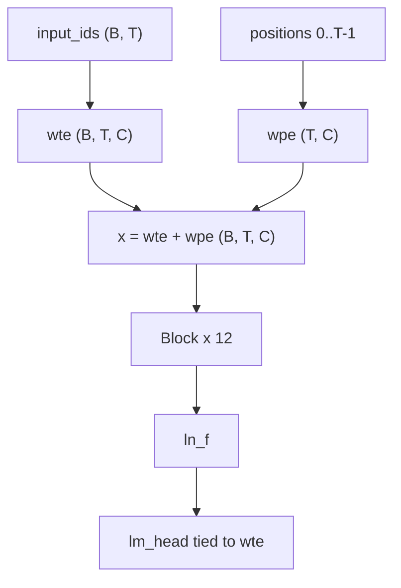
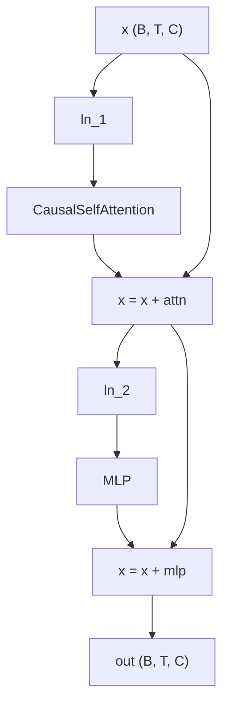
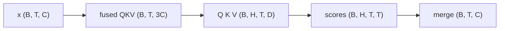
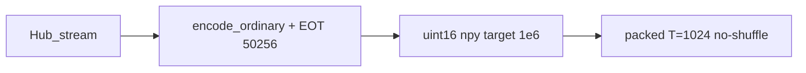
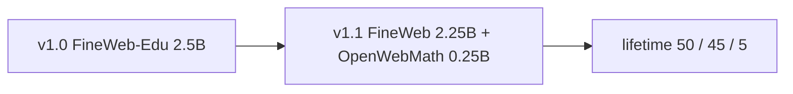
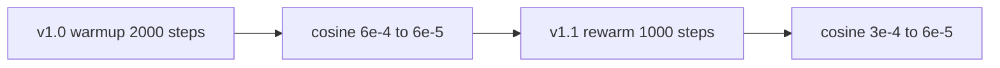
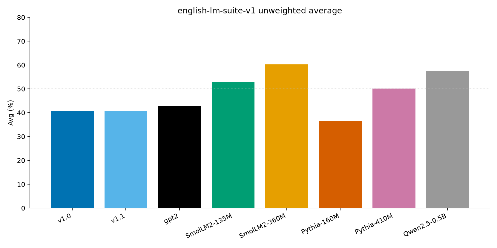

# basikGPT-1 백서

[English](whitepaper.md) · [日本語](whitepaper.ja.md) · **한국어**

| | |
| --- | --- |
| Authors | basikGPT Contributors |
| Document version | 1.1 |
| Date | 2026-08-29 |
| Package | `basikgpt` 0.1.0 |
| Production runs | `main_2p5b` (38,147 steps) → `cont_5b_mix` (76,294 steps) |
| Weights | [`project-iconik/basikGPT-1-v1.0`](https://huggingface.co/project-iconik/basikGPT-1-v1.0), [`project-iconik/basikGPT-1-v1.1`](https://huggingface.co/project-iconik/basikGPT-1-v1.1) |
| Code | [`project-iconik/basikGPT`](https://github.com/project-iconik/basikGPT) |

이 기술 백서는 **basikGPT-1**의 아키텍처, 토크나이저, 데이터 믹스, 완료된 프로덕션 사전학습 두 런, 언어모델 지표, 제로샷 English LM suite 비교를 기록한다.

2.5B 런의 기계 판독 표는 [`runs/main_2p5b/WHITEPAPER.md`](../runs/main_2p5b/WHITEPAPER.md)에 있다. 이 문서는 두 체크포인트의 서사 기록이다.

---

## 목차

1. [초록](#1-초록)
2. [서론](#2-서론)
3. [관련 연구](#3-관련-연구)
4. [모델](#4-모델)
5. [토크나이저](#5-토크나이저)
6. [데이터](#6-데이터)
7. [학습](#7-학습)
8. [컴퓨트](#8-컴퓨트)
9. [언어모델 결과](#9-언어모델-결과)
10. [English LM suite](#10-english-lm-suite)
11. [용도, 한계, 라이선스](#11-용도-한계-라이선스)
12. [재현성](#12-재현성)
13. [결론](#13-결론)
14. [참고문헌](#14-참고문헌)
15. [부록](#appendix)

---

## 1. 초록

basikGPT-1은 PyTorch로 처음부터 학습한 **124,439,808** 파라미터 GPT-2 Small decoder-only Transformer다. 프로덕션 두 단계는 단일 NVIDIA RTX PRO 4500 Blackwell에서 돌렸다.

- **v1.0** (`main_2p5b`): FineWeb-Edu **2,500,001,792** 토큰(약 **20.09** tokens/parameter)을 **29,462.59 s**(8.18 GPU hours). 학습 후 full validation 교차엔트로피 / perplexity는 **3.2548 / 25.9151**. 프로토콜 HellaSwag `acc_norm`은 **29.40%**.
- **v1.1** (`cont_5b_mix`): v1.0을 FineWeb 2.25B + OpenWebMath 0.25B로 2.5B 토큰 더 이어감. 생애 토큰 **5,000,003,584**(약 **40.18** tokens/parameter). 이 단계 벽시계는 **29,593.20 s**(8.22 GPU hours). LAMBADA는 **+3.47 pp**, ARC-Easy는 **−4.50 pp**.

가중치는 Hugging Face Hub의 `GPT2LMHeadModel` 내보내기다: [`project-iconik/basikGPT-1-v1.0`](https://huggingface.co/project-iconik/basikGPT-1-v1.0), [`project-iconik/basikGPT-1-v1.1`](https://huggingface.co/project-iconik/basikGPT-1-v1.1).

모델은 사전학습된 **base**다. 비교표는 공유 프로토콜 베이스라인이다.

---

## 2. 서론

공개 GPT-2 Small 체크포인트는 이미 있다. 그러나 참조 로짓 패리티가 있는 아키텍처, 문서화된 공개 코퍼스 파이프라인, packed uint16 샤드, 동결된 단일 GPU 레시피, 저장소 안 평가 스위트라는 한 세트는 교육과 리버스 엔지니어링에 여전히 쓸모가 있다.

basikGPT-1은 다음 세 제약으로 처음부터 학습했다.

- **아키텍처 충실도.** 디코더는 GPT-2 Small과 같다: 12 Pre-Norm 블록, 12 heads, `d_model` 768, 학습된 절대 위치, LayerNorm, GPT-2 GELU, tied embeddings, bias. 공식 `openai-community/gpt2` 가중치는 변환 경로로 로드되며 문서화된 허용오차 안에서 로짓이 맞는다.
- **1단계는 Chinchilla 근처의 고유 데이터.** Hoffmann 등은 대략 20 tokens/parameter를 제안한다. v1.0은 124.4M 고유 파라미터에 FineWeb-Edu(`sample-10BT`)를 한 번만 본 2.50B 토큰을 썼다.
- **단일 24–32 GB GPU.** 시퀀스 길이 1024, micro-batch 8, gradient accumulation 8, BF16, SDPA로 실측 할당은 약 9.5 GiB다.

2단계는 문서화된 연속학습이다. SmolLM `python-edu`를 넣던 초기 믹스안은 **실행하지 않았다**. v1.1은 FineWeb + OpenWebMath만 썼다.

---

## 3. 관련 연구

백본은 GPT-2 [Radford et al., 2019]를 따른다: Pre-Norm 잔차 블록, 학습된 절대 위치 임베딩, 인과적 multi-head self-attention, tied embedding / LM head. 학습 스택은 현대화되어 있다(AdamW, cosine decay, BF16, PyTorch SDPA). 충실도 계층은 [`docs/pretraining_recipe.md`](pretraining_recipe.md)에 적혀 있다.

1단계 토큰 예산은 Chinchilla 계산 최적비(대략 20 tokens/parameter) [Hoffmann et al., 2022]를 따른다. 실행된 v1.0 비는 FineWeb-Edu 2.5B 토큰 1패스에서 20.09 tokens/parameter다.

사전학습 데이터는 v1.0이 FineWeb-Edu [Penedo et al. / HuggingFaceFW], 연속이 FineWeb과 OpenWebMath [Paster et al.]다. 상세와 라이선스는 [§6](#6-데이터)와 [§11](#11-용도-한계-라이선스)에 있다.

평가 쪽에서 공식 GPT-2 Small은 동일 아키텍처 참조다. Pythia [Biderman et al., 2023], SmolLM2, Qwen2.5-0.5B는 저장소 안 프로토콜 `english-lm-suite-v1`로 측정했고 논문 발표 숫자는 섞지 않았다. 토큰 수와 아키텍처는 **맞추지 않았다**. 공유 채점 규칙 아래의 베이스라인이다.

---

## 4. 모델

프리셋은 `src/basikgpt/config.py`의 `gpt2_small`. GPT-2 인과 디코더: 토큰 임베딩, 학습된 위치 임베딩, Pre-Norm Transformer 블록 12개, 최종 LayerNorm, LM head. LM head 가중치는 임베딩 행렬과 같다(`tie_word_embeddings=true`)므로 50,257 × 768 표는 한 번만 센다(**38,597,376** 고유 파라미터). 분해는 [부록](#a1-고유-파라미터-분해)에 있다.

| Field | Value |
| --- | --- |
| Unique parameters | 124,439,808 |
| `vocab_size` | 50,257 |
| `d_model` (`hidden_size`) | 768 |
| `n_layers` | 12 |
| `n_heads` | 12 |
| `head_dim` | 64 |
| `d_ff` (`intermediate_size`) | 3,072 |
| `context_length` | 1,024 |
| LayerNorm `eps` | 1e-5 |
| Attention / MLP / LayerNorm bias | true (`lm_head` bias false) |
| `tie_word_embeddings` | true |
| Activation | GELU tanh approximation |
| Position encoding | learned absolute |
| Attention | causal multi-head self-attention (not GQA) |
| Training sequence length | **1024** |
| Training dropout | **0.0** (`GPTConfig` default is 0.1; pretraining CLIs override) |

**왜 이 선택인가.** 참조 패리티를 검증할 때까지 2019 GPT-2 Small 위상을 동결한다. 잔차 투영은 GPT-2 스케일 초기화 `std = 0.02 / sqrt(2 * n_layers)`를 쓴다. Attention은 스케일 `1/sqrt(64)`의 scaled dot-product다. 학습은 SDPA 백엔드, 검증용 eager 경로가 있다.

**컨텍스트 길이.** 위치는 1024만 할당·학습한다. RoPE 표도, 쓰지 않는 긴 컨텍스트 예비도 없다.

디코더 스택. 고유 파라미터 124,439,808. `tie_word_embeddings=true`. 학습 dropout 0.0.



Pre-Norm 블록. 잔차 스트림은 정규화하지 않는다: `x = x + attn(ln_1(x))`, 이어서 `x = x + mlp(ln_2(x))`.



Attention 형상. 스케일 `1/sqrt(64)`. 인과적 multi-head.



텐서 기호 `B`, `T`, `C`, `H`, `D`, `V`는 [`docs/tensor_conventions.md`](tensor_conventions.md)에 정의한다.

---

## 5. 토크나이저

GPT-2 byte-level BPE(`tiktoken.get_encoding("gpt2")`). 어휘 50,257. End-of-text id **50,256**.

학습 수집은 문서 본문에 `encode_ordinary()`를 쓰고(페이지 안의 리터럴 `<|endoftext|>`는 일반 바이트), 문서 경계로 EOT를 하나 붙인다. 매니페스트는 `special_token_policy: encode_ordinary + appended EOT`로 기록한다. 학습 기기의 tiktoken은 `0.14.0`이었다.

Hub 내보내기는 공식 GPT-2 토크나이저 파일을 `GPT2LMHeadModel` safetensors 옆에 두므로 `transformers.AutoTokenizer`는 같은 BPE를 읽는다.

---

## 6. 데이터

Hub 스트림은 저장소 파이프라인(`scripts/prepare_fineweb_edu.py`, `scripts/prepare_hf_corpus.py`)과 토큰 예산을 쓴다. 문서는 토큰화한 뒤 목표 1,000,000 토큰의 **uint16** `.npy` 샤드로 팩하고 SHA-256 체크섬을 단다. train/validation 분할은 `sha256-hash-bucket-v1`(salt `basikgpt-fineweb-edu-v1`). 샤드는 순차 읽기(`--no-shuffle`)라 실행된 prefix를 재현할 수 있다.



### 6.1 v1.0 믹스 (`main_2p5b`)

`HuggingFaceFW/fineweb-edu` `sample-10BT`, revision `87f09149ef4734204d70ed1d046ddc9ca3f2b8f9`, 라이선스 **ODC-By 1.0**. 로컬 샤드: `data/fineweb-edu-2p5b/`.

| Manifest field | Value |
| --- | --- |
| Train / validation documents | 2,421,794 / 5,007 |
| Train / validation tokens | 2,499,999,466 / 4,986,319 |
| Train / validation shards | 2,500 / 5 |
| Packed train sequences (T=1024) | 2,440,000 |
| Discarded train tail tokens | 1,436,966 |
| Validation fraction | 0.005 |

v1.0은 2,500,000,000 토큰을 요청했고 실행은 **2,500,001,792**(+1,792 overshoot; 38,147 × 65,536).

### 6.2 v1.1 연속 믹스 (`cont_5b_mix`)

이 단계 이후 생애 믹스: FineWeb-Edu **50%** + FineWeb **45%** + OpenWebMath **5%**. 연속 자체는 FineWeb 2.25B + OpenWebMath 0.25B이며, 오프라인으로 **OpenWebMath 샤드 1 + FineWeb 샤드 9 / 주기**, 그다음 FineWeb tail(`math1_fineweb9`). validation은 v1.0 FineWeb-Edu holdout을 유지한다.

| Source | Hub | Revision | Tokens in this stage |
| --- | --- | --- | --- |
| FineWeb | `HuggingFaceFW/fineweb` `sample-10BT` | `9bb295ddab0e05d785b879661af7260fed5140fc` | 2,249,995,296 (2,250 shards) |
| OpenWebMath | `open-web-math/open-web-math` | `fde8ef8de2300f5e778f56261843dab89f230815` | 249,999,979 (250 shards) |
| **Stage train total** | | | **2,499,995,275** |

SmolLM `python-edu`를 10% 넣던 초안은 **실행하지 않았다**. v1.1에 코드 슬라이스는 없다.



0.25B 수학 슬라이스는 수식이 미지의 분포가 되지 않게 하려는 것이다. GSM8K는 평가 프로토콜에 없다.

---

## 7. 학습

설정 동결: [`configs/gpt2_small_fineweb_edu_single_gpu.json`](../configs/gpt2_small_fineweb_edu_single_gpu.json)(provisional). `scripts/train.py`는 그 JSON을 읽지 않는다. 프로덕션은 동등 CLI 플래그를 썼다. 정본 레시피는 Candidate A(`compile=false`, B=8, G=8).

optimizer step당 토큰은 항상 `8 × 8 × 1024` = **65,536**.

학습률 경로. v1.0: 2,000 스텝 워밍업 후 cosine 6e-4 → 6e-5. v1.1은 step 38,147에서 재개: 1,000 스텝 rewarm 6e-5 → 3e-4, 이후 cosine으로 6e-5.



### 7.1 Stage v1.0

| Item | Value |
| --- | --- |
| `max_steps` | 38,147 |
| Token budget (executed) | 2,500,001,792 |
| `sequence_length` | 1024 |
| `micro_batch_size` × `gradient_accumulation_steps` | 8 × 8 |
| Optimizer | AdamW |
| `learning_rate` / `min_lr` | 6e-4 / 6e-5 |
| Warmup / schedule | 2,000 linear warmup, then cosine |
| `betas` / `eps` | [0.9, 0.95] / 1e-8 |
| `weight_decay` | 0.1 on rank-2 matrices (124,318,464 params); 0 on 1D (121,344) |
| `max_grad_norm` | 1.0 |
| `precision` | bf16 |
| `sdpa_kernel` | auto |
| `compile` | false |
| `seed` | 1337 |
| `eval_interval` / `eval_tokens` | 1,526 / 131,072 |
| Checkpoint steps | 1,526, 7,630, 15,259, 38,147 |

AdamW 그룹은 tied 파라미터 중복을 건너뛰어 `wte`와 `lm_head`를 두 번 감쇠하지 않는다.

### 7.2 Stage v1.1

`runs/main_2p5b/step-00038147.pt`에서 가중치와 optimizer를 재개. `schedule_origin_step` 38,147. 첫 resume은 `--reset-data-index`로 새 믹스를 sample 0부터 시작한다.

| Item | Value |
| --- | --- |
| Final step | 76,294 |
| Lifetime tokens | 5,000,003,584 (+3,584 overshoot) |
| This-stage steps / tokens | 38,147 / 2,500,001,792 |
| LR | rewarm 6e-5 → 3e-4 over 1,000 steps, then cosine to 6e-5 |
| Other optimizer / batch fields | same as v1.0 |
| `seed` | 1337 |

**FineWeb-Edu 한 에포크 뒤, 다른 믹스.** 연속은 의도적으로 Edu 분포를 떠난다. v1.1 동안 FineWeb-Edu validation CE가 오르는 것은 예상이다.

---

## 8. 컴퓨트

| Field | v1.0 | v1.1 (this stage) |
| --- | --- | --- |
| GPU | NVIDIA RTX PRO 4500 Blackwell | same |
| VRAM | 33,685,569,536 bytes (~31.37 GiB) | same |
| PyTorch / CUDA (torch) / driver | 2.8.0+cu128 / 12.8 / 580.159.04 | same |
| Cloud | RunPod | RunPod |
| Wall-clock (s) | 29,462.59 | 29,593.20 |
| GPU hours | 8.1841 | 8.2203 |
| Training-only tok/s | 85,076 | ~84,700 |
| Peak CUDA allocated (MiB) | 9,523.61 | 9,528.69 |

v1.1 `summary.json`의 `training_only_tokens_per_sec`는 **169,416**이다. **생애** 5.0B 토큰을 이 단계 학습 시간으로 나눈 값이다. 단계 토큰 2,500,001,792 / `train_elapsed_seconds` 29,513.24 s ≈ **84,708** tok/s로 v1.0과 맞는다.

피크 할당은 약 9.5 GiB에 머물렀으므로 이 배치 형태에서는 24 GB 카드에 여유가 있다. Hub 수집과 샤드 팩 벽시계는 step 1 이전이며 GPU-hour 합계에 넣지 않는다.

---

## 9. 언어모델 결과

`train.py` 이후 `scripts/write_whitepaper_snapshot.py`가 v1.0 복사용 표를 `training_log` / `metrics.jsonl`에서 썼다. 아래 숫자는 그 스냅샷과 학습 후 평가 JSON에서 가져온다. **루프 안 validation은 131,072 토큰**이며 packed validation 전체가 아니다.

균일 어휘 참조: ln(50,257) ≈ **10.8249**. train loss는 step 1에서 그 선 근처(10.9094)로 시작해 3.28까지 내려간다.

### 9.1 v1.0 학습 곡선

| Metric | Value | Step |
| --- | --- | --- |
| first train loss | 10.9094 | 1 |
| last train loss | 3.2830 | 38,147 |
| min in-loop val CE / PPL | 3.3052 / 27.2551 | 36,624 |
| full val CE / PPL | 3.2548 / 25.9151 | 38,147 (post-hoc) |
| tokens processed | 2,500,001,792 | |
| wall time (s) | 29,462.59 | |

### 9.2 v1.0 체크포인트 사다리 (사후)

Full FineWeb-Edu validation과 HellaSwag validation은 번호 붙은 네 체크포인트에 대해 학습 **후**에 측정했다. 학습 루프 안이 아니다. `step-final.pt`는 step 38,147과 같다.

| Step | Tokens (approx.) | Full val CE / PPL | HellaSwag acc_raw | HellaSwag acc_norm |
| --- | ---: | ---: | ---: | ---: |
| 1,526 | 100M | 4.701 / 110.05 | 26.38% | 25.05% |
| 7,630 | 500M | 3.660 / 38.86 | 26.76% | 27.16% |
| 15,259 | 1B | 3.479 / 32.43 | 27.20% | 27.71% |
| 38,147 | 2.5B | 3.255 / 25.92 | 28.10% | **29.33%** |

이후 `english-lm-suite-v1` 재채점에서 같은 2.5B 체크포인트의 HellaSwag `acc_norm`은 **29.40%**(2,952 / 10,042). 29.33%는 앞선 단독 HellaSwag 덤프(`hellaswag-step-00038147.json`)다. 10절은 스위트 값을 프로토콜 공식 점수로 쓴다.

### 9.3 v1.1 학습 곡선

validation은 FineWeb-Edu로 남고 train은 Edu를 떠난다.

| Metric | Value | Step |
| --- | --- | --- |
| first train loss (this stage) | 3.8090 | 38,150 |
| last train loss | 3.5349 | 76,294 |
| min in-loop val CE / PPL | 3.3214 / 27.6990 | 38,150 |
| final in-loop val CE | 3.4710 | 76,294 |
| lifetime tokens | 5,000,003,584 | |

Edu val CE 3.32 → 3.47 상승은 예상된 분포 이동이다. v1.1에는 `runs/cont_5b_mix/` 안에 사후 full-val / HellaSwag-step JSON이 없다. 그 체크포인트의 다운스트림 점수는 [`benchmarks/`](../benchmarks/)에만 있다.

---

## 10. English LM suite

사전학습 후 두 체크포인트를 프로토콜 **`english-lm-suite-v1`**로 제로샷 채점했다. split·프롬프트·채점식은 [`benchmarks/REPORT.md`](../benchmarks/REPORT.md)와 `src/basikgpt/evaluation/`에 동결되어 있다. lm-eval-harness는 의존성이 아니다. 다른 논문 발표 숫자는 섞지 않았다.

토크나이저와 사전학습 데이터는 모델마다 다르다. **공유 프로토콜 아래의 베이스라인이다.**

| Task | Split | Primary metric | n | Chance (not subtracted) |
| --- | --- | --- | ---: | --- |
| HellaSwag | validation | acc_norm (mean completion LL) | 10,042 | 25% |
| LAMBADA (OpenAI) | test | last-word greedy accuracy | 5,153 | open-vocab |
| PIQA | validation (`baber/piqa`) | acc_norm | 1,838 | 50% |
| WinoGrande | validation (`winogrande_xl`) | acc_raw | 1,267 | 50% |
| ARC-Easy | test | acc_norm | 2,376 | 1/N (typically 25%) |

객관식은 context와 `" " + ending`을 따로 인코딩해 이어 붙이고, 필요하면 context를 왼쪽에서 자르며 **choice 토큰만** 채점한다. `acc_raw`는 로그우도 합, `acc_norm`은 평균. LAMBADA는 마지막 공백으로 나누고 마지막 단어 전체의 greedy 토큰 일치를 요구한다.

두 forward 경로는 프롬프트와 argmax 규칙을 공유한다: GPT-2 경로(basikGPT `.pt`와 공식 `gpt2`, tiktoken `gpt2`)와 SmolLM2 / Pythia / Qwen용 `AutoModelForCausalLM`. 토큰화는 맞추지 않았으므로 점수는 프로토콜 비교이지, 토큰 일치 perplexity가 아니다.

체크포인트: v1.0 `runs/main_2p5b/step-00038147.pt`, v1.1 `runs/cont_5b_mix/step-00076294.pt`. 중간 100M / 500M / 1B는 이 스위트에 없다.

| Model | Params | Corpus | HS acc_norm | LAMBADA | PIQA | WG | ARC-E | Avg |
| --- | ---: | --- | ---: | ---: | ---: | ---: | ---: | ---: |
| **v1.0** | 124M | FineWeb-Edu 2.5B | **29.40%** | **19.58%** | **61.37%** | **50.51%** | **43.01%** | **40.77%** |
| **v1.1** | 124M | Edu 2.5B + FineWeb 2.25B + OpenWebMath 0.25B | **28.75%** | **23.05%** | **61.75%** | **50.83%** | **38.51%** | **40.58%** |
| `openai-community/gpt2` | 124M | WebText | 30.37% | 30.93% | 62.57% | 51.62% | 38.13% | 42.72% |
| SmolLM2-135M | 135M | SmolLM2 mix | 42.67% | 42.97% | 67.57% | 51.93% | 59.43% | 52.91% |
| SmolLM2-360M | 362M | SmolLM2 mix | 55.23% | 53.25% | 71.71% | 54.14% | 66.75% | 60.22% |
| Pythia-160M | 162M | The Pile | 29.26% | 11.57% | 58.32% | 49.49% | 34.22% | 36.57% |
| Pythia-410M | 405M | The Pile | 39.18% | 47.33% | 67.68% | 51.14% | 45.12% | 50.09% |
| Qwen2.5-0.5B | 494M | Qwen2.5 mix | 51.26% | 51.99% | 70.18% | 55.64% | 57.83% | 57.38% |

WG는 acc_raw, 나머지 열은 스위트 primary metric. Avg는 그 다섯 값의 단순 평균.





**점수 읽기.**

- **v1.1 vs v1.0.** LAMBADA **+3.47 pp**(19.58 → 23.05): FineWeb 산문이 last-word 예측을 의도한 방향으로 움직였다. ARC-Easy **−4.50 pp**(43.01 → 38.51): Edu에 맞던 과학 문항 우위가 옅어졌다. HellaSwag −0.65 pp. PIQA와 WinoGrande 변동은 0.4 pp 미만.
- **공식 GPT-2 Small 대비.** 같은 디코더, 같은 tiktoken, 같은 completion NLL. primary에서 gpt2를 이긴 것은 v1.0 ARC-Easy **+4.88 pp**뿐이다. LAMBADA는 여전히 크게 낮다(v1.0 −11.35 pp, v1.1 −7.88 pp). HellaSwag는 약간 아래(v1.0 −0.97 pp, v1.1 −1.62 pp).
- **HellaSwag ~29%.** 우연 25% 위, gpt2·Pythia-160M과 같은 띠, SmolLM2-135M 42.67%보다 훨씬 아래. 가까운 파라미터 수가 가까운 데이터 예산을 뜻하지 않는다.
- **WinoGrande.** 여덟 모델 모두 49.5–55.6%. n=1,267에서 50%의 표준오차는 약 1.4 pp라 50.51%와 50.83%는 우연과 구분되지 않는다.
- **규모 사다리.** SmolLM2-360M과 Qwen2.5-0.5B는 124M GPT-2 급보다 분명히 위다. 예상된 믹스·스케일 차이다.

공개 점수: [`benchmarks/REPORT.md`](../benchmarks/REPORT.md)와 [`benchmarks/summary.json`](../benchmarks/summary.json). 그림 재생성: `python scripts/plot_lm_suite_compare.py`.

---

## 11. 용도, 한계, 라이선스

### 용도

basikGPT-1은 연구·교육·추가 사전학습·파인튜닝용 영어 **base** 모델이다.

FineWeb-Edu 체크포인트(ARC-Easy가 더 강함)는 **v1.0**, 5B 연속(LAMBADA는 오르고 ARC-Easy는 내린다)은 **v1.1**. 아래 예시는 v1.1을 로드한다.

아키텍처와 토크나이저는 GPT-2 호환이다. `transformers.AutoModelForCausalLM.from_pretrained`는 Hub 내보내기를 **로드한다**:

```python
from transformers import AutoModelForCausalLM, AutoTokenizer

tok = AutoTokenizer.from_pretrained("project-iconik/basikGPT-1-v1.1")
model = AutoModelForCausalLM.from_pretrained("project-iconik/basikGPT-1-v1.1")
```

네이티브 `.pt`는 `basikgpt` 패키지로 로드한다. Hub 스냅샷은 `GPT2LMHeadModel` safetensors와 공식 GPT-2 토크나이저 파일이다. optimizer 상태는 포함하지 않는다.

### 한계

- 124M / 2.5B–5B 토큰은 훨씬 큰 믹스로 학습한 현대 135M 모델을 따라가지 못한다.
- 믹스는 영어 중심 웹 텍스트와 작은 수학 슬라이스다. 책만 모은 코퍼스, 대화, instruction, 선호 학습은 없다.
- 루프 안 validation CE/PPL은 131,072 토큰 부분집합이며 packed validation 전체가 아니다.
- FineWeb-Edu / FineWeb 스트림은 순차 prefix(`--no-shuffle`)이지 전체 크롤의 무작위 표본이 아니다.
- PII 처리는 상위 FineWeb / FineWeb-Edu / OpenWebMath 파이프라인이 이미 적용한 것에 의존한다.
- 학습 컨텍스트는 1024 토큰이다.
- v1.1 FineWeb-Edu val CE는 val이 Edu로 남아서 v1.0보다 나쁘다.
- 자유 생성 샘플은 이 문서용으로 보관하지 않았다.

### 라이선스

코드와 내보낸 가중치는 **Apache-2.0**. 학습 데이터에는 데이터셋 카드가 그대로 적용된다. 재배포 전에 각 카드를 확인하라.

| Source | License note |
| --- | --- |
| FineWeb-Edu | ODC-By 1.0 |
| FineWeb | ODC-By 1.0 |
| OpenWebMath | see Hub dataset card |
| GPT-2 tokenizer / architecture | follows the public GPT-2 artifacts |

이 문서는 새 라이선스를 고르지 않는다.

---

## 12. 재현성

| Step | Path |
| --- | --- |
| Architecture / config | `src/basikgpt/config.py` (`gpt2_small`) |
| Frozen single-GPU JSON | `configs/gpt2_small_fineweb_edu_single_gpu.json` |
| FineWeb-Edu ingest | `scripts/prepare_fineweb_edu.py` → `data/fineweb-edu-2p5b/` |
| HF corpus ingest | `scripts/prepare_hf_corpus.py` |
| Mix interleave | `scripts/combine_shards.py` → `data/mix_5b_cont/` |
| v1.0 train | `python scripts/train.py` with the CLI in [`docs/main_2p5b.md`](main_2p5b.md) |
| v1.1 train | resume from `runs/main_2p5b/step-00038147.pt`; see `runs/cont_5b_mix/run.json` |
| Full val CE/PPL | `scripts/evaluate.py` |
| HellaSwag (standalone) | `scripts/evaluate_hellaswag.py` |
| English suite | `scripts/evaluate_lm_suite.py` |
| HF export | `scripts/export_hf.py` |
| Snapshot tables | `scripts/write_whitepaper_snapshot.py` |
| Suite figures | `scripts/plot_lm_suite_compare.py` |

v1.0 학습 CLI:

```bash
python scripts/train.py \
  --model-preset gpt2_small --device cuda --precision bf16 \
  --batch-size 8 --grad-accum-steps 8 \
  --target-tokens 2500000000 \
  --warmup-steps 2000 --lr 6e-4 --min-lr 6e-5 \
  --eval-at-start --eval-tokens 131072 --eval-interval 1526 \
  --log-interval 10 \
  --checkpoint-steps 1526,7630,15259,38147 \
  --no-shuffle --track-data-index \
  --data-dir data/fineweb-edu-2p5b \
  --output-dir runs/main_2p5b
```

스위트:

```bash
python scripts/evaluate_lm_suite.py --checkpoint runs/main_2p5b/step-00038147.pt
python scripts/evaluate_lm_suite.py --checkpoint runs/cont_5b_mix/step-00076294.pt --model-id basikgpt-5b
python scripts/evaluate_lm_suite.py --protocol-all --device cuda
python scripts/plot_lm_suite_compare.py
```

`data/` 아래 큰 샤드와 `runs/` 아래 `.pt`는 gitignore된다. 프로덕션 2.5B 수집은 디스크와 Hub 스트림이 필요하다.

기록된 git SHA(둘 다 dirty):

| Artifact | Commit |
| --- | --- |
| v1.0 train / post-hoc val | `95e63c325591a96c1a71a288f03742049a589d04` |
| v1.1 train / english-lm-suite-v1 | `ff8b2c0284668c3333d268b27864460e2b1db5f7` |

dirty 트리는 SHA가 출처이지 비트 단위 레시피 잠금이 아님을 뜻한다.

---

## 13. 결론

basikGPT-1은 완결된 GPT-2 Small 사전학습이다: 검증된 124,439,808 파라미터 디코더, GPT-2 BPE, 문서화된 FineWeb-Edu 2.5B 단계(20.09 tokens/parameter, 8.18 GPU hours, full-val PPL 25.92), 문서화된 FineWeb+OpenWebMath 5B 연속, 저장소 안 제로샷 영어 스위트.

v1.0은 HellaSwag에서 공식 gpt2 옆, ARC-Easy에서는 위, LAMBADA가 가장 큰 간격이다. v1.1은 그 LAMBADA 간격의 일부를 메우고 ARC-Easy 우위를 돌려준다. 이 프로토콜의 같은 크기 공개 디코더는 가깝고, 더 큰 현대 믹스로 학습한 135M–0.5B는 위에 있다. 예상된 규모·데이터 사다리다.

---

## 14. 참고문헌

- Radford, A., et al. (2019). *Language Models are Unsupervised Multitask Learners.* OpenAI.
- Hoffmann, J., et al. (2022). *Training Compute-Optimal Large Language Models* (Chinchilla). arXiv:2203.15556.
- Biderman, S., et al. (2023). *Pythia: A Suite for Analyzing Large Language Models Across Training and Scaling.* arXiv:2304.01373.
- HuggingFaceFW. *FineWeb-Edu* (`sample-10BT`). https://huggingface.co/datasets/HuggingFaceFW/fineweb-edu
- HuggingFaceFW. *FineWeb.* https://huggingface.co/datasets/HuggingFaceFW/fineweb
- Paster, K., et al. *OpenWebMath.* https://huggingface.co/datasets/open-web-math/open-web-math
- OpenAI. *GPT-2 Small.* https://huggingface.co/openai-community/gpt2
- HuggingFaceTB. *SmolLM2.* https://huggingface.co/HuggingFaceTB/SmolLM2-135M
- Alibaba. *Qwen2.5-0.5B.* https://huggingface.co/Qwen/Qwen2.5-0.5B
- Zellers, R., et al. (2019). *HellaSwag: Can a Machine Really Finish Your Sentence?* ACL.
- Paperno, D., et al. (2016). *The LAMBADA dataset.*
- Bisk, Y., et al. (2020). *PIQA: Reasoning about Physical Commonsense in Natural Language.*
- Sakaguchi, K., et al. (2020). *WinoGrande.*
- Clark, P., et al. (2018). *Think you have Solved Question Answering? Try ARC.*
- basikGPT-1 v1.0 weights. https://huggingface.co/project-iconik/basikGPT-1-v1.0
- basikGPT-1 v1.1 weights. https://huggingface.co/project-iconik/basikGPT-1-v1.1
- basikGPT code. https://github.com/project-iconik/basikGPT

스위트 프로토콜: [`benchmarks/REPORT.md`](../benchmarks/REPORT.md). 기계 판독 롤업: [`benchmarks/summary.json`](../benchmarks/summary.json).

```
@software{basikgpt,
  title = {basikGPT},
  author = {basikGPT Contributors},
  url = {https://github.com/project-iconik/basikGPT},
  year = {2026}
}
```

---

## Appendix

### A.1 고유 파라미터 분해

tied 입력 임베딩 / LM head는 한 번만 센다. `lm_head`(bias false)를 제외한 Linear·LayerNorm bias를 포함한다.

| Block | Count |
| --- | ---: |
| Token embedding 50,257 × 768 (tied with LM head) | 38,597,376 |
| Position embedding 1,024 × 768 | 786,432 |
| 12 × attention (Q/K/V/O 768×768 + bias) | 28,348,416 |
| 12 × MLP (768↔3072 + bias) | 56,669,184 |
| 12 × 2 LayerNorm (768+768) + final LayerNorm | 38,400 |
| **Unique total** | **124,439,808** |

untied 합계는 163,037,184. 실측 고유 파라미터 수는 이 표와 같다.
