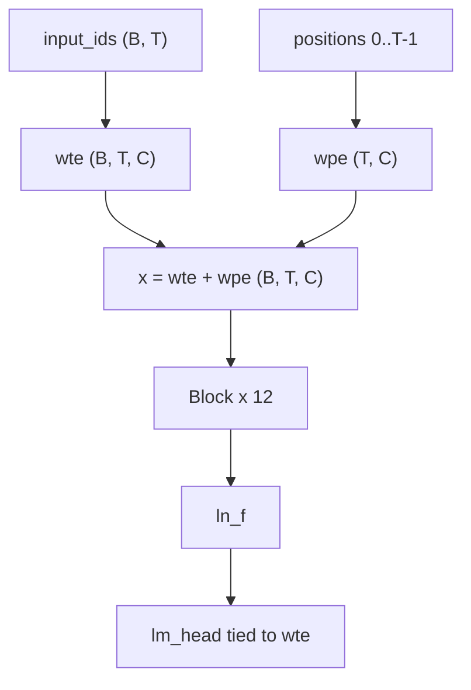
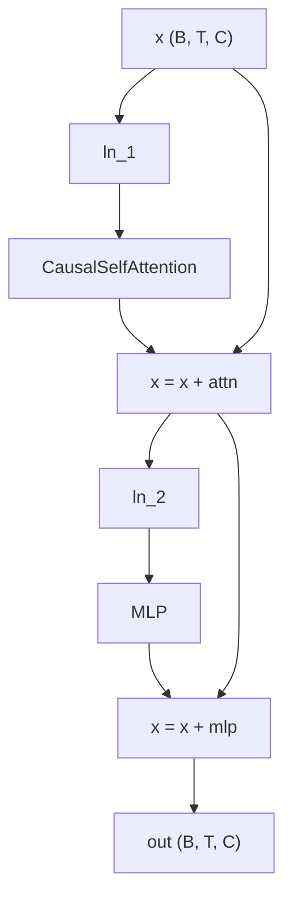
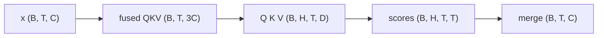
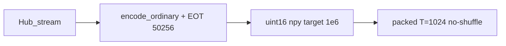
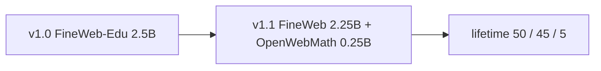
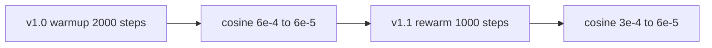

# basikGPT-1 백서

[English](whitepaper.md) · [日本語](whitepaper.ja.md) · **한국어**

| | |
| --- | --- |
| 저자 | basikGPT Contributors |
| 문서 버전 | 1.1 |
| 날짜 | 2026-08-29 |
| 패키지 | `basikgpt` 0.1.0 |
| 프로덕션 실행 | `main_2p5b`(38,147스텝) → `cont_5b_mix`(76,294스텝) |
| 가중치 | [`project-iconik/basikGPT-1-v1.0`](https://huggingface.co/project-iconik/basikGPT-1-v1.0), [`project-iconik/basikGPT-1-v1.1`](https://huggingface.co/project-iconik/basikGPT-1-v1.1) |
| 코드 | [`project-iconik/basikGPT`](https://github.com/project-iconik/basikGPT) |

이 기술 백서는 **basikGPT-1**의 아키텍처, 토크나이저, 데이터 구성, 완료된 두 차례의 프로덕션 사전학습 실행, 언어 모델 지표, 제로샷 영어 언어 모델 평가 스위트 비교를 기록한다.

2.5B 실행의 기계 생성 스냅샷 표는 [`runs/main_2p5b/WHITEPAPER.md`](../runs/main_2p5b/WHITEPAPER.md)에 있다. 본 문서는 두 체크포인트를 모두 다루는 종합 기술 보고서다.

---

## 목차

1. [초록](#1-초록)
2. [서론](#2-서론)
3. [관련 연구](#3-관련-연구)
4. [모델](#4-모델)
5. [토크나이저](#5-토크나이저)
6. [데이터](#6-데이터)
7. [학습](#7-학습)
8. [계산 자원](#8-계산-자원)
9. [언어모델 결과](#9-언어모델-결과)
10. [영어 언어 모델 평가 스위트](#10-영어-언어-모델-평가-스위트)
11. [용도, 한계, 라이선스](#11-용도-한계-라이선스)
12. [재현성](#12-재현성)
13. [결론](#13-결론)
14. [참고문헌](#14-참고문헌)
15. [부록](#appendix)

---

## 1. 초록

basikGPT-1은 PyTorch로 처음부터 학습한 고유 파라미터 **124,439,808**개의 GPT-2 Small 디코더 전용 Transformer다. 두 프로덕션 단계는 모두 단일 NVIDIA RTX PRO 4500 Blackwell에서 실행했다.

- **v1.0** (`main_2p5b`): FineWeb-Edu **2,500,001,792**토큰(파라미터당 약 **20.09**토큰)을 **29,462.59초**(8.18 GPU 시간) 동안 학습했다. 학습 후 전체 검증 교차엔트로피와 퍼플렉시티는 각각 **3.2548**과 **25.9151**이며, 평가 스위트 프로토콜에서 측정한 HellaSwag `acc_norm`은 **29.40%**다.
- **v1.1** (`cont_5b_mix`): v1.0 체크포인트에서 시작해 FineWeb 2.25B + OpenWebMath 0.25B로 2.5B토큰을 추가 학습했다. 누적 토큰 수는 **5,000,003,584**(파라미터당 약 **40.18**토큰)이며, 이 단계의 실제 경과 시간은 **29,593.20초**(8.22 GPU 시간)다. LAMBADA는 **+3.47 pp** 상승했고 ARC-Easy는 **−4.50 pp** 하락했다.

가중치는 `GPT2LMHeadModel` 형식으로 Hugging Face Hub에 공개되어 있다: [`project-iconik/basikGPT-1-v1.0`](https://huggingface.co/project-iconik/basikGPT-1-v1.0), [`project-iconik/basikGPT-1-v1.1`](https://huggingface.co/project-iconik/basikGPT-1-v1.1).

본 모델은 사전학습된 **베이스(base) 모델**이다. 비교표는 공통 프로토콜에 따른 기준 결과다.

---

## 2. 서론

공개 GPT-2 Small 체크포인트는 이미 있다. 그러나 기준 모델과의 로짓 일치가 검증된 아키텍처, 문서화된 공개 코퍼스 파이프라인, 패킹된 uint16 샤드, 기록된 단일 GPU 학습 레시피, 저장소 내 평가 스위트로 구성된 통합 스택은 교육과 리버스 엔지니어링에 여전히 유용하다.

basikGPT-1은 다음 세 가지 제약 아래 처음부터 학습했다.

- **아키텍처 충실도.** 디코더는 GPT-2 Small과 동일하게 사전 정규화 블록 12개, 어텐션 헤드 12개, `d_model` 768, 학습 가능한 절대 위치 임베딩, LayerNorm, GPT-2 GELU, 공유 임베딩, 편향을 사용한다. 공식 `openai-community/gpt2` 가중치는 변환 경로를 통해 로드할 수 있으며, 로짓은 문서화된 허용오차 안에서 일치한다.
- **1단계의 Chinchilla 계산 최적비에 가까운 데이터 규모.** Hoffmann 등은 파라미터당 약 20토큰을 제안한다. v1.0은 고유 파라미터 124.4M개에 대해 FineWeb-Edu(`sample-10BT`)를 한 번 순차적으로 통과하며 2.50B토큰을 사용했다.
- **단일 24–32 GB GPU.** 시퀀스 길이 1024, 마이크로배치 8, 그래디언트 누적 8, BF16, SDPA를 사용했으며, 실측 최대 메모리 할당량은 약 9.5 GiB였다.

2단계는 문서화된 연속 학습이다. SmolLM `python-edu`를 포함했던 초기 데이터 구성 초안은 **실행하지 않았다**. v1.1에는 FineWeb과 OpenWebMath만 사용했다.

---

## 3. 관련 연구

백본은 GPT-2 [Radford et al., 2019]를 따른다. 사전 정규화 잔차 블록, 학습 가능한 절대 위치 임베딩, 인과적 다중 헤드 자기 어텐션, 입력 임베딩과 LM 헤드의 가중치 공유를 사용한다. 학습 스택에는 AdamW, 코사인 감쇠, BF16, PyTorch SDPA 등 현대적인 방식을 적용했다. 호환성 수준은 [`docs/pretraining_recipe.md`](pretraining_recipe.md)에 설명되어 있다.

1단계 토큰 예산은 Chinchilla 계산 최적비(파라미터당 약 20토큰) [Hoffmann et al., 2022]를 따른다. 실제 v1.0의 비율은 FineWeb-Edu 2.5B토큰을 한 번 통과했을 때 파라미터당 20.09토큰이다.

사전학습 데이터로 v1.0 단계에서는 FineWeb-Edu [Penedo et al. / HuggingFaceFW]를, 연속 학습 단계에서는 FineWeb과 OpenWebMath [Paster et al.]를 사용했다. 자세한 내용과 라이선스는 [§6](#6-데이터)과 [§11](#11-용도-한계-라이선스)에 제시한다.

평가에서는 공식 GPT-2 Small을 동일 아키텍처의 기준 모델로 사용했다. Pythia [Biderman et al., 2023], SmolLM2, Qwen2.5-0.5B는 저장소 내 프로토콜 `english-lm-suite-v1`로 측정했으며, 다른 논문에 보고된 수치는 함께 사용하지 않았다. 토큰 수와 아키텍처는 **일치시키지 않았다**. 이는 공통 채점 규칙에 따른 기준 결과다.

---

## 4. 모델

`gpt2_small` 프리셋은 `src/basikgpt/config.py`에 정의되어 있다. GPT-2 인과 디코더는 토큰 임베딩, 학습 가능한 위치 임베딩, 사전 정규화 Transformer 블록 12개, 최종 LayerNorm, LM 헤드로 구성된다. LM 헤드 가중치는 임베딩 행렬과 공유되므로(`tie_word_embeddings=true`), 50,257 × 768 가중치 테이블은 고유 파라미터로 한 번만 집계한다(**38,597,376**개). 자세한 파라미터 내역은 [부록](#a1-고유-파라미터-분해)에 제시한다.

| 항목 | 값 |
| --- | --- |
| Unique parameters | 124,439,808 |
| `vocab_size` | 50,257 |
| `d_model` (`hidden_size`) | 768 |
| `n_layers` | 12 |
| `n_heads` | 12 |
| `head_dim` | 64 |
| `d_ff` (`intermediate_size`) | 3,072 |
| `context_length` | 1,024 |
| LayerNorm `eps` | 1e-5 |
| 어텐션 / MLP / LayerNorm 편향 | true (`lm_head` 편향 false) |
| `tie_word_embeddings` | true |
| Activation | GELU tanh approximation |
| Position encoding | learned absolute |
| Attention | causal multi-head self-attention (not GQA) |
| 학습 시퀀스 길이 | **1024** |
| 학습 드롭아웃 | **0.0** (`GPTConfig` 기본값은 0.1이며 학습 CLI에서 덮어씀) |

**왜 이 선택인가.** 구현 과정에서는 기준 모델과의 일치를 확립하기 위해 2019년 GPT-2 Small의 원형 구조를 유지했다. 잔차 투영에는 GPT-2의 스케일 조정 초기화 `std = 0.02 / sqrt(2 * n_layers)`를 사용한다. 어텐션에는 스케일 `1/sqrt(64)`의 스케일드 닷 프로덕트를 사용한다. 학습에는 SDPA 백엔드를 사용하며, 검증용 eager 경로도 제공한다.

**컨텍스트 길이.** 위치 임베딩은 1,024개 위치까지만 할당하고 학습한다. RoPE 테이블이나 더 긴 컨텍스트를 위한 미사용 영역은 확보하지 않는다.

디코더 스택의 고유 파라미터 수는 124,439,808개이며, `tie_word_embeddings=true`를 사용한다. 학습 시 드롭아웃은 0.0이었다.



각 사전 정규화 블록에서 잔차 스트림 자체는 잔차를 더하기 전에 정규화하지 않는다: `x = x + attn(ln_1(x))`, 이어서 `x = x + mlp(ln_2(x))`.



어텐션 경로는 스케일 `1/sqrt(64)`의 인과적 다중 헤드 어텐션을 사용하며, 텐서 형상은 다음과 같다.



텐서 기호 `B`, `T`, `C`, `H`, `D`, `V`는 [`docs/tensor_conventions.md`](tensor_conventions.md)에 정의되어 있다.

---

## 5. 토크나이저

GPT-2 바이트 수준 BPE(`tiktoken.get_encoding("gpt2")`)를 사용한다. 어휘 크기는 50,257이며, 문서 종료 토큰 ID는 **50,256**이다.

학습 데이터 전처리에서는 문서 본문에 `encode_ordinary()`를 적용한다. 따라서 문서에 포함된 리터럴 문자열 `<|endoftext|>`는 일반 바이트열로 인코딩된다. 각 문서 경계에는 EOT 토큰을 하나 추가한다. 매니페스트에는 이를 `special_token_policy: encode_ordinary + appended EOT`로 기록한다. 학습 환경에서 사용한 tiktoken 버전은 `0.14.0`이었다.

Hub 내보내기에는 공식 GPT-2 토크나이저 파일이 `GPT2LMHeadModel` safetensors와 함께 포함되므로, `transformers.AutoTokenizer`는 동일한 BPE를 로드한다.

---

## 6. 데이터

Hub 스트림은 저장소의 데이터 파이프라인(`scripts/prepare_fineweb_edu.py`, `scripts/prepare_hf_corpus.py`)과 지정된 토큰 예산에 따라 처리한다. 문서를 토큰화한 뒤 목표 크기가 1,000,000토큰인 **uint16** `.npy` 샤드로 패킹하고 SHA-256 체크섬을 기록한다. 학습/검증 분할에는 `sha256-hash-bucket-v1`(솔트 `basikgpt-fineweb-edu-v1`)을 사용한다. 샤드를 순차적으로 읽기 때문에(`--no-shuffle`) 실제 학습에 사용된 데이터의 선두 구간을 재현할 수 있다.



### 6.1 v1.0 믹스 (`main_2p5b`)

이 데이터는 `HuggingFaceFW/fineweb-edu`의 `sample-10BT` 설정에서 구축했다. 리비전은 `87f09149ef4734204d70ed1d046ddc9ca3f2b8f9`, 라이선스는 **ODC-By 1.0**이며, 로컬 샤드는 `data/fineweb-edu-2p5b/`에 저장했다.

| 매니페스트 항목 | 값 |
| --- | --- |
| 학습 / 검증 문서 | 2,421,794 / 5,007 |
| 학습 / 검증 토큰 | 2,499,999,466 / 4,986,319 |
| 학습 / 검증 샤드 | 2,500 / 5 |
| 패킹된 학습 시퀀스(T=1024) | 2,440,000 |
| 폐기한 학습 말단 토큰 | 1,436,966 |
| 검증 비율 | 0.005 |

v1.0의 요청 토큰 수는 2,500,000,000이었으나 실제로는 **2,500,001,792**토큰을 처리해 목표보다 1,792토큰 초과했다(38,147 × 65,536).

### 6.2 v1.1 연속 학습 데이터 구성 (`cont_5b_mix`)

이 단계 이후의 누적 데이터 구성은 FineWeb-Edu **50%** + FineWeb **45%** + OpenWebMath **5%**다. 연속 학습 단계 자체는 FineWeb 2.25B + OpenWebMath 0.25B로 구성된다. 오프라인에서 주기마다 **OpenWebMath 샤드 1개 + FineWeb 샤드 9개**를 교차 배치한 뒤 마지막에 FineWeb 구간을 덧붙였다(`math1_fineweb9`). 검증 데이터는 v1.0의 FineWeb-Edu 홀드아웃을 그대로 유지했다.

| 소스 | Hub | 리비전 | 본 단계 토큰 수 |
| --- | --- | --- | --- |
| FineWeb | `HuggingFaceFW/fineweb` `sample-10BT` | `9bb295ddab0e05d785b879661af7260fed5140fc` | 2,249,995,296 (2,250 shards) |
| OpenWebMath | `open-web-math/open-web-math` | `fde8ef8de2300f5e778f56261843dab89f230815` | 249,999,979 (250 shards) |
| **단계별 학습 합계** | | | **2,499,995,275** |

SmolLM `python-edu`를 10% 포함했던 초안은 **실행하지 않았다**. v1.1에는 프로그래밍 코드 데이터가 포함되지 않았다.



0.25B 규모의 수학 데이터는 수학 표현이 학습 분포에서 완전히 벗어나지 않도록 포함했다. GSM8K는 평가 프로토콜에 포함하지 않았다.

---

## 7. 학습

잠정 학습 레시피 스냅샷은 [`configs/gpt2_small_fineweb_edu_single_gpu.json`](../configs/gpt2_small_fineweb_edu_single_gpu.json)에 기록되어 있다. `scripts/train.py`는 이 JSON을 직접 읽지 않으며, 프로덕션 실행에서는 이에 상응하는 CLI 플래그를 사용했다. 기준 학습 레시피는 Candidate A(`compile=false`, B=8, G=8)다.

옵티마이저 스텝당 토큰 수는 `8 × 8 × 1024` = **65,536**으로 고정했다.

학습률 스케줄은 다음과 같다. v1.0에서는 2,000스텝 동안 워밍업한 뒤 6e-4에서 6e-5까지 코사인 감쇠를 적용했다. v1.1은 38,147스텝에서 재개했으며, 1,000스텝 동안 6e-5에서 3e-4까지 다시 워밍업한 뒤 6e-5까지 코사인 감쇠를 적용했다.



### 7.1 v1.0 단계

| 항목 | 값 |
| --- | --- |
| `max_steps` | 38,147 |
| 실제 토큰 수 | 2,500,001,792 |
| `sequence_length` | 1024 |
| `micro_batch_size` × `gradient_accumulation_steps` | 8 × 8 |
| Optimizer | AdamW |
| `learning_rate` / `min_lr` | 6e-4 / 6e-5 |
| Warmup / schedule | 2,000 linear warmup, then cosine |
| `betas` / `eps` | [0.9, 0.95] / 1e-8 |
| `weight_decay` | 0.1 on rank-2 matrices (124,318,464 params); 0 on 1D (121,344) |
| `max_grad_norm` | 1.0 |
| `precision` | bf16 |
| `sdpa_kernel` | `auto`(자동 선택) |
| `compile` | `false`(비활성화) |
| `seed` | 1337 |
| `eval_interval` / `eval_tokens` | 1,526 / 131,072 |
| 체크포인트 스텝 | 1,526, 7,630, 15,259, 38,147 |

AdamW 파라미터 그룹은 공유 파라미터의 중복을 제외하므로 `wte`와 `lm_head`에 가중치 감쇠를 이중으로 적용하지 않는다.

### 7.2 v1.1 단계

`runs/main_2p5b/step-00038147.pt`에서 가중치와 옵티마이저 상태를 복원해 학습을 재개했다. `schedule_origin_step`은 38,147이었다. 연속 학습을 시작할 때 `--reset-data-index`를 사용해 새 데이터 구성을 첫 샘플부터 읽었다.

| 항목 | 값 |
| --- | --- |
| 최종 스텝 | 76,294 |
| 누적 토큰 | 5,000,003,584(목표보다 3,584토큰 초과) |
| 본 단계 스텝 / 토큰 | 38,147 / 2,500,001,792 |
| LR | 1,000스텝 동안 6e-5 → 3e-4로 재워밍업한 후 6e-5까지 코사인 감쇠 |
| 기타 옵티마이저 / 배치 필드 | v1.0과 동일 |
| `seed` | 1337 |

**FineWeb-Edu 한 에포크 뒤 다른 데이터 구성으로 전환.** 연속 학습 단계에서는 의도적으로 FineWeb-Edu와 다른 데이터 분포를 사용했다. 따라서 v1.1에서 FineWeb-Edu 검증 CE가 상승하는 것은 예상된 결과다.

---

## 8. 계산 자원

| 항목 | v1.0 | v1.1(본 단계) |
| --- | --- | --- |
| GPU | NVIDIA RTX PRO 4500 Blackwell | 동일 |
| VRAM | 33,685,569,536 bytes (~31.37 GiB) | 동일 |
| PyTorch / CUDA (torch) / driver | 2.8.0+cu128 / 12.8 / 580.159.04 | 동일 |
| Cloud | RunPod | RunPod |
| Wall-clock (s) | 29,462.59 | 29,593.20 |
| GPU hours | 8.1841 | 8.2203 |
| Training-only tok/s | 85,076 | ~84,700 |
| Peak CUDA allocated (MiB) | 9,523.61 | 9,528.69 |

v1.1 `summary.json`의 `training_only_tokens_per_sec`는 **169,416**이다. 이는 **누적** 5.0B토큰을 이 단계의 학습 시간으로 나눈 값이다. 본 단계의 토큰 수 2,500,001,792를 `train_elapsed_seconds` 29,513.24초로 나누면 약 **84,708 tok/s**로, v1.0과 일치한다.

최대 메모리 할당량은 약 9.5 GiB에 머물렀으므로 이 배치 구성에서는 24 GB 카드에도 여유가 있다. Hub 데이터 수집과 샤드 패킹은 첫 학습 스텝 전에 수행됐으며, 해당 시간은 GPU 사용 시간 합계에 포함하지 않았다.

---

## 9. 언어모델 결과

`train.py` 실행 후 `scripts/write_whitepaper_snapshot.py`가 `training_log` / `metrics.jsonl`에서 v1.0용 재사용 가능 표를 생성했다. 아래 수치는 이 스냅샷과 학습 후 평가 JSON에 기반한다. **학습 루프 내 검증은 131,072토큰**을 사용하며, 패킹된 검증 데이터 전체를 사용하지는 않는다.

어휘에 대한 균등분포의 교차엔트로피 기준값은 ln(50,257) ≈ **10.8249**다. 학습 손실은 첫 스텝에서 이 기준값에 가까운 10.9094로 시작해 3.28까지 감소한다.

### 9.1 v1.0 학습 곡선

| 지표 | 값 | 스텝 |
| --- | --- | --- |
| 첫 학습 손실 | 10.9094 | 1 |
| 마지막 학습 손실 | 3.2830 | 38,147 |
| 최소 루프 내 검증 CE / PPL | 3.3052 / 27.2551 | 36,624 |
| 전체 검증 CE / PPL | 3.2548 / 25.9151 | 38,147(사후 평가) |
| 처리한 토큰 | 2,500,001,792 | |
| 실제 경과 시간(초) | 29,462.59 | |

### 9.2 v1.0 단계별 체크포인트 결과(사후 평가)

전체 FineWeb-Edu 검증과 HellaSwag 검증은 네 개의 지정 체크포인트에서 학습 **완료 후** 측정했으며, 학습 루프 내 평가는 아니다. `step-final.pt`는 38,147스텝 체크포인트와 동일하다.

| Step | Tokens (approx.) | Full val CE / PPL | HellaSwag acc_raw | HellaSwag acc_norm |
| --- | ---: | ---: | ---: | ---: |
| 1,526 | 100M | 4.701 / 110.05 | 26.38% | 25.05% |
| 7,630 | 500M | 3.660 / 38.86 | 26.76% | 27.16% |
| 15,259 | 1B | 3.479 / 32.43 | 27.20% | 27.71% |
| 38,147 | 2.5B | 3.255 / 25.92 | 28.10% | **29.33%** |

이후 `english-lm-suite-v1`로 같은 2.5B 체크포인트를 다시 채점했을 때 HellaSwag `acc_norm`은 **29.40%**(2,952 / 10,042)였다. 29.33%는 이전의 독립 HellaSwag 결과 파일(`hellaswag-step-00038147.json`)에 기록된 값이다. 10절에서는 평가 스위트 결과를 이 프로토콜의 기준 점수로 사용한다.

### 9.3 v1.1 학습 곡선

검증 데이터는 FineWeb-Edu로 유지했지만, 학습 데이터 분포는 FineWeb-Edu에서 벗어났다.

| 지표 | 값 | 스텝 |
| --- | --- | --- |
| 첫 학습 손실(본 단계) | 3.8090 | 38,150 |
| 마지막 학습 손실 | 3.5349 | 76,294 |
| 최소 루프 내 검증 CE / PPL | 3.3214 / 27.6990 | 38,150 |
| 최종 루프 내 검증 CE | 3.4710 | 76,294 |
| 누적 토큰 | 5,000,003,584 | |

Edu 검증 CE가 3.32에서 3.47로 상승한 것은 예상된 분포 이동의 결과다. v1.1에는 `runs/cont_5b_mix/` 내 사후 전체 검증 / HellaSwag 스텝별 JSON이 없다. 해당 체크포인트의 다운스트림 평가 점수는 [`benchmarks/`](../benchmarks/)에만 있다.

---

## 10. 영어 언어 모델 평가 스위트

사전학습 후 두 체크포인트를 **`english-lm-suite-v1`** 프로토콜로 제로샷 평가했다. 데이터 분할, 프롬프트, 채점식은 [`benchmarks/REPORT.md`](../benchmarks/REPORT.md)와 `src/basikgpt/evaluation/`에 고정되어 있다. 이 구현은 lm-eval-harness에 의존하지 않으며, 다른 논문에 보고된 수치는 함께 사용하지 않았다.

토크나이저와 사전학습 데이터는 모델마다 다르다. **따라서 이 결과는 공통 프로토콜에 따른 기준 비교다.**

| Task | Split | Primary metric | n | 무작위 추측 확률(감산하지 않음) |
| --- | --- | --- | ---: | --- |
| HellaSwag | validation | acc_norm (mean completion LL) | 10,042 | 25% |
| LAMBADA (OpenAI) | test | last-word greedy accuracy | 5,153 | open-vocab |
| PIQA | validation (`baber/piqa`) | acc_norm | 1,838 | 50% |
| WinoGrande | validation (`winogrande_xl`) | acc_raw | 1,267 | 50% |
| ARC-Easy | test | acc_norm | 2,376 | 1/N (typically 25%) |

객관식 평가는 context와 `" " + ending`을 각각 인코딩한 뒤 이어 붙이고, 필요한 경우 context의 왼쪽을 잘라 **선택지(choice) 토큰만** 채점한다. `acc_raw`는 로그우도의 총합이며, `acc_norm`은 평균 로그우도이다. LAMBADA는 마지막 공백을 기준으로 분리한 뒤 마지막 단어 전체에 대해 greedy 토큰 일치를 요구한다.

두 순전파 경로는 프롬프트와 argmax 규칙을 공유한다. 한 경로는 tiktoken `gpt2` 토크나이저를 사용하는 basikGPT `.pt` 체크포인트와 공식 `gpt2`를 처리하고, 다른 경로는 SmolLM2, Pythia, Qwen에 `AutoModelForCausalLM`을 사용한다. 토큰화는 일치시키지 않았으므로 점수는 동일 프로토콜 아래에서 비교할 수 있지만, 동일 토큰화 조건의 퍼플렉시티를 비교한 것은 아니다.

평가한 체크포인트는 v1.0 `runs/main_2p5b/step-00038147.pt`와 v1.1 `runs/cont_5b_mix/step-00076294.pt`이다. 중간 단계의 100M / 500M / 1B 체크포인트는 본 평가 스위트에 포함되지 않는다.

| Model | Params | Corpus | HS acc_norm | LAMBADA | PIQA | WG | ARC-E | Avg |
| --- | ---: | --- | ---: | ---: | ---: | ---: | ---: | ---: |
| **v1.0** | 124M | FineWeb-Edu 2.5B | **29.40%** | **19.58%** | **61.37%** | **50.51%** | **43.01%** | **40.77%** |
| **v1.1** | 124M | Edu 2.5B + FineWeb 2.25B + OpenWebMath 0.25B | **28.75%** | **23.05%** | **61.75%** | **50.83%** | **38.51%** | **40.58%** |
| `openai-community/gpt2` | 124M | WebText | 30.37% | 30.93% | 62.57% | 51.62% | 38.13% | 42.72% |
| SmolLM2-135M | 135M | SmolLM2 mix | 42.67% | 42.97% | 67.57% | 51.93% | 59.43% | 52.91% |
| SmolLM2-360M | 362M | SmolLM2 mix | 55.23% | 53.25% | 71.71% | 54.14% | 66.75% | 60.22% |
| Pythia-160M | 162M | The Pile | 29.26% | 11.57% | 58.32% | 49.49% | 34.22% | 36.57% |
| Pythia-410M | 405M | The Pile | 39.18% | 47.33% | 67.68% | 51.14% | 45.12% | 50.09% |
| Qwen2.5-0.5B | 494M | Qwen2.5 mix | 51.26% | 51.99% | 70.18% | 55.64% | 57.83% | 57.38% |

WG 열은 `acc_raw`를 나타내며, 나머지 열은 평가 스위트의 주요 지표(primary metric)이다. Avg는 이들 다섯 개 지표의 단순 산술평균이다.


**점수 해석.**

- **v1.1과 v1.0 비교.** LAMBADA는 **+3.47 pp**(19.58 → 23.05) 상승했다. FineWeb 연속 학습과 마지막 단어 예측 성능 향상이 함께 관찰됐다. ARC-Easy는 **−4.50 pp**(43.01 → 38.51) 하락해 Edu 중심 과학 문항에서의 우위가 줄었다. HellaSwag는 0.65 pp 하락했으며, PIQA와 WinoGrande의 변동은 0.4 pp 미만이었다.
- **공식 GPT-2 Small과 비교.** 모델들은 동일한 디코더 아키텍처와 tiktoken 토크나이저, 완성문 NLL 채점 방식을 사용한다. 주요 지표에서 gpt2를 앞선 경우는 v1.0의 ARC-Easy **+4.88 pp**뿐이다. LAMBADA는 여전히 크게 낮고(v1.0 −11.35 pp, v1.1 −7.88 pp), HellaSwag도 약간 낮다(v1.0 −0.97 pp, v1.1 −1.62 pp).
- **HellaSwag 약 29%.** 무작위 추측 수준인 25%보다는 높고 gpt2·Pythia-160M과 비슷한 범위에 있지만, SmolLM2-135M의 42.67%보다는 훨씬 낮다. 파라미터 수가 비슷하더라도 학습 데이터 예산은 크게 다를 수 있다.
- **WinoGrande.** 여덟 모델 모두 49.5–55.6%. n=1,267에서 50%의 표준오차는 약 1.4 pp라 50.51%와 50.83%는 우연과 구분되지 않는다.
- **모델 규모별 경향.** SmolLM2-360M과 Qwen2.5-0.5B는 124M GPT-2급보다 분명히 높은 점수를 보인다. 이는 데이터 구성과 모델 규모의 차이에 부합하는 결과다.

공개 점수: [`benchmarks/REPORT.md`](../benchmarks/REPORT.md)와 [`benchmarks/summary.json`](../benchmarks/summary.json). 그림 재생성: `python scripts/plot_lm_suite_compare.py`.

---

## 11. 용도, 한계, 라이선스

### 용도

basikGPT-1은 연구, 교육, 추가 사전학습, 파인튜닝을 위한 영어 **베이스(base) 모델**이다.

상대적으로 높은 ARC-Easy 점수가 필요한 경우에는 FineWeb-Edu 체크포인트인 **v1.0**을 사용한다. LAMBADA 점수가 높고 ARC-Easy 점수가 낮은 누적 5B토큰 연속 학습 체크포인트가 필요한 경우에는 **v1.1**을 사용한다. 아래 예시는 v1.1을 로드한다.

아키텍처와 토크나이저는 GPT-2와 호환된다. Hub에 내보낸 모델은 `transformers.AutoModelForCausalLM.from_pretrained`로 직접 로드할 수 있다.

```python
from transformers import AutoModelForCausalLM, AutoTokenizer

tok = AutoTokenizer.from_pretrained("project-iconik/basikGPT-1-v1.1")
model = AutoModelForCausalLM.from_pretrained("project-iconik/basikGPT-1-v1.1")
```

네이티브 `.pt` 체크포인트는 `basikgpt` 패키지로 로드한다. Hub 스냅샷에는 `GPT2LMHeadModel` safetensors와 공식 GPT-2 토크나이저 파일이 포함되며, 옵티마이저 상태는 포함되지 않는다.

### 한계

- 2.5B–5B토큰으로 학습한 124M 모델이 본 비교에 포함된 135M 모델을 비롯해 훨씬 크고 다양한 코퍼스로 학습한 현대 모델과 동등한 성능을 내기는 어렵다.
- 데이터 구성은 영어 중심 웹 텍스트와 소량의 수학 데이터로 이루어진다. 별도의 도서 코퍼스, 대화 데이터, 지시 데이터, 선호도 튜닝은 포함하지 않았다.
- 학습 루프 내 검증 CE/PPL은 131,072토큰으로 구성된 부분집합을 사용하며, 패킹된 검증 데이터 전체를 사용하지는 않는다.
- FineWeb-Edu / FineWeb 스트림은 전체 크롤의 무작위 표본이 아니라 순차적인 선두 구간(`--no-shuffle`)을 사용했다.
- 원본 FineWeb, FineWeb-Edu, OpenWebMath 데이터셋 파이프라인에서 수행한 처리 외에 별도의 PII 필터링은 적용하지 않았다.
- 학습 컨텍스트는 1024 토큰이다.
- v1.1의 FineWeb-Edu 검증 CE는 검증 데이터가 Edu로 유지됐기 때문에 v1.0보다 높다.
- 자유 생성 샘플은 이 문서용으로 보관하지 않았다.

### 라이선스

코드와 내보낸 가중치에는 **Apache-2.0** 라이선스가 적용된다. 학습 데이터에는 각 데이터셋 카드의 조건이 계속 적용되므로 재배포 전에 해당 조건을 확인해야 한다.

| 소스 | 라이선스 참고 사항 |
| --- | --- |
| FineWeb-Edu | ODC-By 1.0 |
| FineWeb | ODC-By 1.0 |
| OpenWebMath | Hub 데이터셋 카드 참조 |
| GPT-2 토크나이저 / 아키텍처 | 공개 GPT-2 아티팩트에 수반되는 조건 참조 |

본 문서는 새로운 라이선스를 지정하거나 변경하지 않는다.

---

## 12. 재현성

| 단계 | 경로 |
| --- | --- |
| Architecture / config | `src/basikgpt/config.py` (`gpt2_small`) |
| Frozen single-GPU JSON | `configs/gpt2_small_fineweb_edu_single_gpu.json` |
| FineWeb-Edu ingest | `scripts/prepare_fineweb_edu.py` → `data/fineweb-edu-2p5b/` |
| HF corpus ingest | `scripts/prepare_hf_corpus.py` |
| Mix interleave | `scripts/combine_shards.py` → `data/mix_5b_cont/` |
| v1.0 학습 | [`docs/main_2p5b.md`](main_2p5b.md)의 CLI로 `python scripts/train.py` 실행 |
| v1.1 학습 | `runs/main_2p5b/step-00038147.pt`에서 재개. `runs/cont_5b_mix/run.json` 참조 |
| Full val CE/PPL | `scripts/evaluate.py` |
| HellaSwag (standalone) | `scripts/evaluate_hellaswag.py` |
| English suite | `scripts/evaluate_lm_suite.py` |
| HF export | `scripts/export_hf.py` |
| Snapshot tables | `scripts/write_whitepaper_snapshot.py` |
| Suite figures | `scripts/plot_lm_suite_compare.py` |

v1.0 학습 CLI:

```bash
python scripts/train.py \
  --model-preset gpt2_small --device cuda --precision bf16 \
  --batch-size 8 --grad-accum-steps 8 \
  --target-tokens 2500000000 \
  --warmup-steps 2000 --lr 6e-4 --min-lr 6e-5 \
  --eval-at-start --eval-tokens 131072 --eval-interval 1526 \
  --log-interval 10 \
  --checkpoint-steps 1526,7630,15259,38147 \
  --no-shuffle --track-data-index \
  --data-dir data/fineweb-edu-2p5b \
  --output-dir runs/main_2p5b
```

스위트:

```bash
python scripts/evaluate_lm_suite.py --checkpoint runs/main_2p5b/step-00038147.pt
python scripts/evaluate_lm_suite.py --checkpoint runs/cont_5b_mix/step-00076294.pt --model-id basikgpt-5b
python scripts/evaluate_lm_suite.py --protocol-all --device cuda
python scripts/plot_lm_suite_compare.py
```

`data/` 하위의 대용량 샤드 파일과 `runs/` 하위의 `.pt` 체크포인트 파일은 Git 추적에서 제외(.gitignore)된다. 2.5B 프로덕션 데이터 인제스트를 재현하려면 충분한 디스크 공간과 Hugging Face Hub 스트리밍 연결이 필요하다.

기록된 Git SHA(두 실행 모두 커밋되지 않은 변경 사항 포함):

| 아티팩트 | 커밋 |
| --- | --- |
| v1.0 학습 / 사후 검증 | `95e63c325591a96c1a71a288f03742049a589d04` |
| v1.1 학습 / english-lm-suite-v1 | `ff8b2c0284668c3333d268b27864460e2b1db5f7` |

작업 트리에 커밋되지 않은 변경 사항이 있으므로 해당 SHA는 코드의 출처를 나타낼 뿐, 전체 학습 레시피의 비트 단위 재현성을 보장하지 않는다.

---

## 13. 결론

basikGPT-1은 두 단계로 구성된 완결된 GPT-2 Small 사전학습 프로젝트다. 기준 모델과의 일치가 검증된 124,439,808파라미터 디코더와 GPT-2 BPE를 구현했으며, FineWeb-Edu 2.5B토큰 단계(파라미터당 20.09토큰, 8.18 GPU 시간, 전체 검증 PPL 25.92)와 FineWeb+OpenWebMath를 사용한 누적 5B토큰 연속 학습 단계를 문서화했다. 저장소 내에는 제로샷 영어 평가 스위트도 포함되어 있다.

v1.0은 HellaSwag에서 공식 gpt2와 비슷한 점수를 기록했고 ARC-Easy에서는 더 높은 점수를 보였지만, LAMBADA에서는 가장 큰 차이가 남았다. v1.1은 LAMBADA 차이를 일부 줄인 대신 ARC-Easy의 우위를 잃었다. 일부 비슷한 크기의 기존 디코더는 이 프로토콜에서 대체로 비슷한 범위에 있지만, SmolLM2-135M과 더 큰 현대 모델은 훨씬 높은 점수를 기록한다. 이러한 경향은 모델 규모와 학습 데이터의 차이에 부합한다.

---

## 14. 참고문헌

- Radford, A., et al. (2019). *Language Models are Unsupervised Multitask Learners.* OpenAI.
- Hoffmann, J., et al. (2022). *Training Compute-Optimal Large Language Models* (Chinchilla). arXiv:2203.15556.
- Biderman, S., et al. (2023). *Pythia: A Suite for Analyzing Large Language Models Across Training and Scaling.* arXiv:2304.01373.
- HuggingFaceFW. *FineWeb-Edu* (`sample-10BT`). https://huggingface.co/datasets/HuggingFaceFW/fineweb-edu
- HuggingFaceFW. *FineWeb.* https://huggingface.co/datasets/HuggingFaceFW/fineweb
- Paster, K., et al. *OpenWebMath.* https://huggingface.co/datasets/open-web-math/open-web-math
- OpenAI. *GPT-2 Small.* https://huggingface.co/openai-community/gpt2
- HuggingFaceTB. *SmolLM2.* https://huggingface.co/HuggingFaceTB/SmolLM2-135M
- Alibaba. *Qwen2.5-0.5B.* https://huggingface.co/Qwen/Qwen2.5-0.5B
- Zellers, R., et al. (2019). *HellaSwag: Can a Machine Really Finish Your Sentence?* ACL.
- Paperno, D., et al. (2016). *The LAMBADA dataset.*
- Bisk, Y., et al. (2020). *PIQA: Reasoning about Physical Commonsense in Natural Language.*
- Sakaguchi, K., et al. (2020). *WinoGrande.*
- Clark, P., et al. (2018). *Think you have Solved Question Answering? Try ARC.*
- basikGPT-1 v1.0 weights. https://huggingface.co/project-iconik/basikGPT-1-v1.0
- basikGPT-1 v1.1 weights. https://huggingface.co/project-iconik/basikGPT-1-v1.1
- basikGPT code. https://github.com/project-iconik/basikGPT

평가 스위트 프로토콜은 [`benchmarks/REPORT.md`](../benchmarks/REPORT.md)에, 기계 판독 가능한 요약은 [`benchmarks/summary.json`](../benchmarks/summary.json)에 제공한다.

```
@software{basikgpt,
  title = {basikGPT},
  author = {basikGPT Contributors},
  url = {https://github.com/project-iconik/basikGPT},
  year = {2026}
}
```

---

<a id="appendix"></a>

## 부록

### A.1 고유 파라미터 분해

가중치를 공유하는 입력 임베딩과 LM 헤드는 중복 집계하지 않고 한 번만 계산한다. 편향을 사용하지 않는 `lm_head`를 제외하고 Linear와 LayerNorm의 편향을 포함한다.

| Block | Count |
| --- | ---: |
| Token embedding 50,257 × 768 (tied with LM head) | 38,597,376 |
| Position embedding 1,024 × 768 | 786,432 |
| 12 × attention (Q/K/V/O 768×768 + bias) | 28,348,416 |
| 12 × MLP (768↔3072 + bias) | 56,669,184 |
| 12 × 2 LayerNorm (768+768) + final LayerNorm | 38,400 |
| **Unique total** | **124,439,808** |

가중치 비공유(untied) 시 총 파라미터 수는 163,037,184개이며, 실측된 고유 파라미터 수는 본 표와 일치한다.
